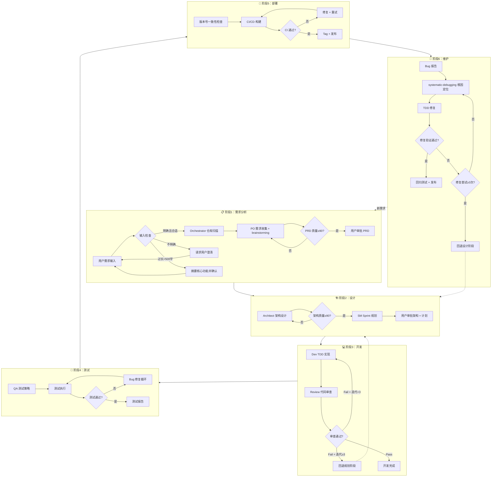
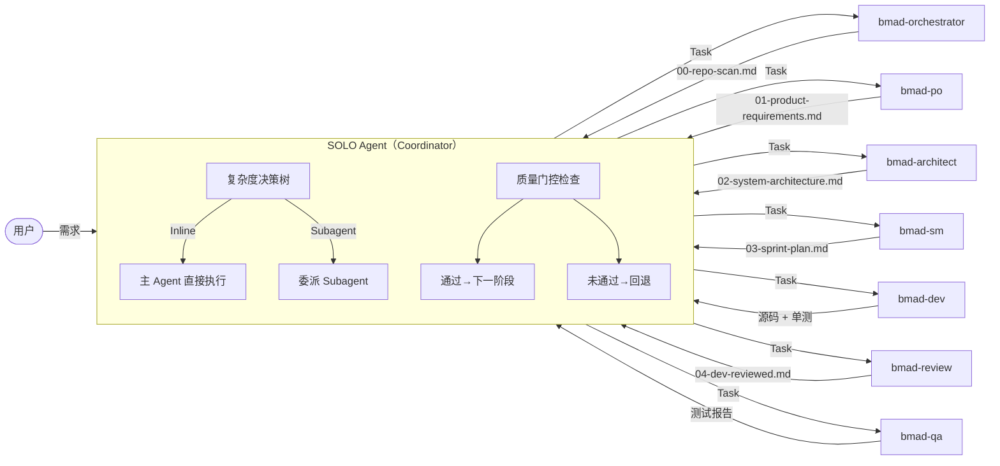
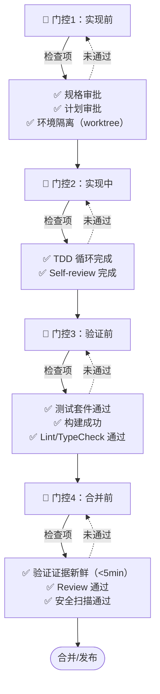
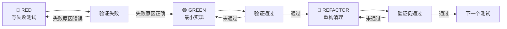
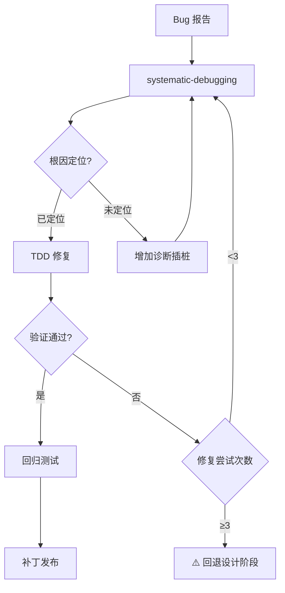
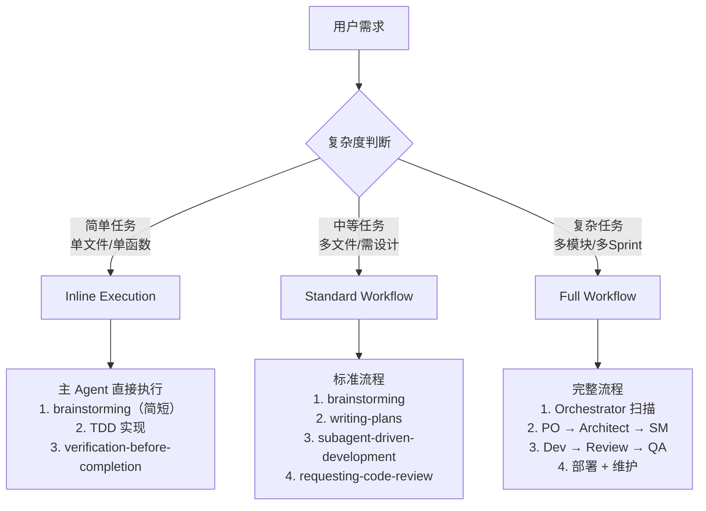

# Agentic AI 编程敏捷开发规范与流程

> **适用环境**：Trae CN IDE（SOLO Agent 模式）  
> **版本**：v1.1 | **更新日期**：2026-07-23  
> **定位**：Trae Agent 可直接执行的全程开发手册，Coordinator 按此规范协调 Subagents 完成需求→部署全流程

---

## 目录

1. [总览与设计原则](#1-总览与设计原则)
2. [角色体系与 Subagent 映射](#2-角色体系与-subagent-映射)
3. [全流程可视化工作流](#3-全流程可视化工作流)
4. [六阶段循环工作模式](#4-六阶段循环工作模式)
5. [复杂度决策树与执行策略](#5-复杂度决策树与执行策略)
6. [质量门控体系](#6-质量门控体系)
7. [异常处理与回退机制](#7-异常处理与回退机制)
8. [Trae CN 长任务模式优化指南](#8-trae-cn-长任务模式优化指南)
9. [规则索引与约束速查](#9-规则索引与约束速查)

---

## 1. 总览与设计原则

### 1.1 核心目标

在 Trae CN SOLO Agent 环境下，实现**高效协作、快速迭代、质量可控**的 Agentic AI 编程，将软件工程六阶段（需求分析、设计、开发、测试、部署、维护）的循环工作模式有机组合为可执行流水线。

### 1.2 设计原则

| 原则 | 说明 |
|------|------|
| **Rules 先行** | 任何操作前检查规则约束（security / compliance / quality / process） |
| **Skills 指导** | 根据任务类型激活对应 Skill，不跳过、不替代 |
| **Subagents 执行** | 复杂任务委派专业代理，主 Agent 仅协调 |
| **Rules 验证** | 产出必须通过规则检查才可流转 |
| **长任务优先** | 每阶段封装为长任务，减少 LLM 交互中断，降低 query 次数 |
| **证据驱动** | 声称完成必须有验证证据，禁止"应该没问题"式声称 |

### 1.3 Trae CN 技术特性适配

- **SOLO Agent**：主 Agent（Coordinator），负责工作流编排、阶段转换、质量门控
- **Subagent**：独立上下文窗口，通过 `.trae/agents/*.md` 定义，由 SOLO Agent 自动调度
- **Skills**：方法论型工具（brainstorming / writing-plans / TDD 等），通过 Skill 工具激活
- **Rules**：`.trae/rules/*.md` 中定义的约束规则，分 `alwaysApply` 和按需触发两类
- **Commands**：`.trae/commands/*.md` 中定义的快捷命令（如 `/bmad-pilot`）
- **长任务模式**：每个 Subagent 派发时传递完整上下文，让其自主完成阶段任务后返回结果，而非频繁中断交互

---

## 2. 角色体系与 Subagent 映射

### 2.1 角色-Subagent-Skill 映射表

| 角色 | Subagent | 核心职责 | 关联 Skill | 产出物 |
|------|----------|---------|-----------|--------|
| **Coordinator** | SOLO Agent（主 Agent 自身） | 工作流编排、门控、异常处理 | — | 门控报告、决策记录 |
| **Orchestrator** | `bmad-orchestrator` | 仓库分析、上下文准备、Review 周期管理 | search | `00-repo-scan.md` |
| **Product Owner** | `bmad-po` | 需求收集、PRD 编写、质量评分 | brainstorming | `01-product-requirements.md` |
| **Architect** | `bmad-architect` | 架构设计、技术选型、质量评分 | brainstorming, writing-plans | `02-system-architecture.md` |
| **Scrum Master** | `bmad-sm` | Sprint 规划、任务拆解、依赖管理 | writing-plans | `03-sprint-plan.md` |
| **Developer** | `bmad-dev` | 功能实现、单元测试、Bug 修复 | TDD, systematic-debugging, subagent-driven-development | 源码 + 单测 |
| **Reviewer** | `bmad-review` | 代码审查、需求合规检查 | requesting-code-review, receiving-code-review | `04-dev-reviewed.md` |
| **QA** | `bmad-qa` | 测试策略、测试执行、回归测试 | verification-before-completion | 测试报告 |

### 2.2 Subagent 配置规范

Subagent 文件位于 `.trae/agents/`，YAML frontmatter 关键字段：

```yaml
---
name: {agent-name}           # 唯一标识，字母开头，含字母/数字/连字符
description: {场景描述}       # SOLO Agent 据此判断何时调用
model: {modelName}           # 可选，指定模型（如 glm-5.2, Doubao-Seed-2.1-Pro）
tools: {tool1}, {tool2}      # 可选，限制可用工具
disallowedTools: {tool}      # 可选，禁止使用的工具
mcpServers:                  # 可选，允许调用的 MCP Server
  - {mcpServerName}
---
```

**模型选择策略**（降低成本、提升效率）：

| 任务复杂度 | 推荐模型 | 典型场景 |
|-----------|---------|---------|
| 机械实现（1-2 文件，规格明确） | 快速模型（DeepSeek-V4-Flash） | CRUD、数据模型、工具函数 |
| 集成判断（多文件协调、模式匹配） | 标准模型（GLM-5.1） | API 集成、组件交互 |
| 架构设计（深度推理、方案评估） | 最强模型（GLM-5.2） | 架构决策、Review、调试 |

---

## 3. 全流程可视化工作流

### 3.1 总览图：六阶段大循环



### 3.2 Coordinator 编排图



### 3.3 质量门控图



---

## 4. 六阶段循环工作模式

### 4.0 通用约定

#### 4.0.1 Orchestrator 中介模式

Coordinator 是用户与 Subagent 之间唯一的交互中介。所有 Subagent **不直接与用户对话**，而是通过 Coordinator 中转：

```
用户 ↔ Coordinator ↔ Subagent（PO / Architect / SM / Dev / Review / QA）
```

交互流程：
1. Subagent 向 Coordinator 返回分析结果和澄清问题
2. Coordinator 将问题一次性呈现给用户
3. 用户回答后，Coordinator 将回答传递给 Subagent
4. Subagent 更新产出后返回给 Coordinator
5. Coordinator 呈现给用户确认

#### 4.0.2 文件保存时机策略

交互阶段（PO / Architect / SM）遵循**"暂不保存直到审批"**原则：

| 阶段 | 操作 | 说明 |
|------|------|------|
| **产出阶段** | Subagent 分析并生成内容 | **不保存文件**，仅返回内容给 Coordinator |
| **呈现阶段** | Coordinator 将内容摘要呈现给用户 | 用户了解产出但不做决定 |
| **审批阶段** | 用户确认 | 用户明确回复"yes/是/确认/继续" |
| **保存阶段** | Coordinator 指示 Subagent 保存 | 文件落盘到 `docs/specs/{feature_name}/` |
| **例外** | 仓库扫描报告（00-repo-scan.md） | 自动保存，无需用户审批 |

#### 4.0.3 feature_name 命名规范

所有产出文件统一存放在 `docs/specs/{feature_name}/` 目录，`{feature_name}` 命名规则：

| 规则 | 说明 | 示例 |
|------|------|------|
| 格式 | kebab-case（小写字母，空格/标点→连字符，连续连字符压缩为一个，首尾修剪） | `user-auth` / `data-export-v2` |
| 来源 | 从需求描述中提取核心功能名称 | "添加用户认证" → `user-auth` |
| 目录 | `docs/specs/{feature_name}/` | `docs/specs/user-auth/` |

#### 4.0.4 输入预处理

Coordinator 收到用户需求后，先执行输入检查：

| 条件 | 处理 |
|------|------|
| 需求描述 >500 字符 | 自动摘要核心功能，请求用户确认理解是否正确 |
| 需求描述不明确（缺少上下文/目标/范围） | 请求用户提供更多具体信息 |
| 需求正常 | 按流程进入阶段1 |

---

### 4.1 阶段1：需求分析

**目标**：将模糊想法转化为质量评分 ≥90 的 PRD

#### 执行步骤（长任务封装）

```markdown
Coordinator 执行：
1. 规则检查 + 输入预处理（见 §4.0.4）
2. 检查规则约束（security-rules, compliance-rules）
3. 委派 bmad-orchestrator 执行仓库扫描
   - 参考 §8.2 仓库扫描模板
   - 输入：项目目录路径
   - 产出：00-repo-scan.md（自动保存，无需审批）

4. 委派 bmad-po 执行需求收集（激活 brainstorming Skill）
   - 参考 §8.2 需求分析阶段模板
   - 输入：用户需求 + 仓库扫描结果
   - 循环：PO 提出澄清问题 → Coordinator 呈现给用户 → 收集回答 → 更新 PRD → 重新评分
   - 终止条件：质量评分 ≥90
   - 注意：PO 暂不保存文件，仅返回内容

5. 呈现 PRD 摘要 + 质量分数，请求用户审批

🛑 关键停止点：等待用户确认（显式回复 "yes/是/确认/继续"）

6. 用户确认后，指示 PO 保存 PRD 至 01-product-requirements.md
```

#### 门控1：实现前 — PRD 审批

| 检查项 | 通过条件 |
|--------|---------|
| PRD 质量评分 | ≥90/100 |
| 用户审批 | 用户明确回复"yes/是/确认/继续" |
| 业务核心约束 | 计算/存储/输出/Agent输出格式明确 |
| feature_name 命名 | 符合 kebab-case 规范（见 §4.0.3） |

#### 交付物

| 文件 | 路径 |
|------|------|
| 仓库扫描 | `docs/specs/{feature_name}/00-repo-scan.md` |
| PRD | `docs/specs/{feature_name}/01-product-requirements.md` |

#### 关联 Skill

- **brainstorming**：需求探索、方案对比、设计确认
- **writing-plans**（后续衔接）：从 PRD 生成实施计划

---

### 4.2 阶段2：设计

**目标**：基于 PRD 产出质量评分 ≥90 的架构文档 + 可执行的 Sprint 计划

#### 执行步骤（长任务封装）

```markdown
Coordinator 执行：
1. 委派 bmad-architect 执行架构设计
   - 参考 §8.2 架构设计阶段模板
   - 输入：PRD 内容 + 仓库扫描结果
   - 循环：架构师提出技术问题 → Coordinator 呈现给用户 → 收集回答 → 更新架构 → 重新评分
   - 终止条件：架构质量评分 ≥90
   - 注意：架构师暂不保存文件，仅返回内容

2. 呈现架构摘要 + 质量分数，请求用户审批

🛑 关键停止点1：等待用户确认架构设计（显式回复 "yes/是/确认/继续"）

3. 用户确认后，指示 Architect 保存架构文档至 02-system-architecture.md

4. 委派 bmad-sm 执行 Sprint 规划（交互式循环）
   - 参考 §8.2 Sprint 规划阶段模板
   - 输入：PRD + 架构文档
   - 循环：SM 提出澄清问题和假设 → Coordinator 呈现给用户 → 收集回答 → 更新计划
   - 终止条件：计划清晰可执行（所有 Story 有 DoD、任务粒度 ≤8h）
   - 注意：SM 暂不保存文件，仅返回内容

5. 呈现 Sprint 计划摘要，请求用户审批

🛑 关键停止点2：等待用户确认 Sprint 计划（显式回复 "yes/是/确认/继续"）

6. 用户确认后，指示 SM 保存 Sprint 计划至 03-sprint-plan.md
```

#### 门控1补充：设计审批

| 检查项 | 通过条件 |
|--------|---------|
| 架构质量评分 | ≥90/100 |
| Sprint 计划 | 所有 Story 有 DoD、任务粒度 ≤8h、Sprint ≤50 points |
| 用户审批 | 用户明确确认架构 + 计划 |
| 环境隔离 | worktree 已创建（using-git-worktrees Skill） |

#### 交付物

| 文件 | 路径 |
|------|------|
| 架构文档 | `docs/specs/{feature_name}/02-system-architecture.md` |
| Sprint 计划 | `docs/specs/{feature_name}/03-sprint-plan.md` |

#### 关联 Skill

- **brainstorming**：技术方案探索与决策
- **writing-plans**：生成 bite-sized 实施计划（TDD 步骤级）
- **using-git-worktrees**：创建隔离工作区

---

### 4.3 阶段3：开发

**目标**：按 Sprint 计划实现全部功能，通过 TDD + Code Review 保证质量

#### 执行步骤（长任务封装）

```markdown
Coordinator 执行：
1. 委派 bmad-dev 执行功能实现
   - 参考 §8.2 开发实现阶段模板
   - 输入：PRD + 架构 + Sprint 计划
   - 执行模式：subagent-driven-development（推荐）或 executing-plans
   - TDD 铁律：RED → GREEN → REFACTOR，先写失败测试再写实现
   - 每个 Sprint 结束后执行 Sprint 验证

#### 代码审查子阶段（独立子阶段，对应 §3.1 总览图中的开发→审查链路）

2. 开发完成后，委派 bmad-review 执行代码审查
   - 参考 §8.2 代码审查阶段模板
   - 输入：PRD + 架构 + Sprint 计划 + 代码变更
   - 产出：04-dev-reviewed.md（Pass / Pass with Risk / Fail）
   - Review 迭代管理：
     - Pass / Pass with Risk → 进入测试阶段
     - Fail + 迭代 < 3 → 返回 Dev 修复
     - Fail + 迭代 = 2 → 安排 SM + Architect + Dev 会议
     - Fail + 迭代 ≥ 3 → 升级人工干预

3. 验证开发产出
   - 运行测试命令，确认测试通过
   - 检查代码规范（ruff check / mypy / eslint）
   - 安全扫描（bandit）
```

#### 门控2：实现中

| 检查项 | 通过条件 |
|--------|---------|
| TDD 循环 | 每个函数有失败测试先行的证据 |
| Self-review | Dev 自查完成 |
| Review 通过 | bmad-review 返回 Pass / Pass with Risk |
| 单测覆盖率 | core ≥80%, agents ≥70%, cli ≥60% |

#### 开发内部循环（TDD）



#### 交付物

| 文件 | 路径 |
|------|------|
| 源码 | 项目源码目录 |
| Review 报告 | `docs/specs/{feature_name}/04-dev-reviewed.md` |

#### 关联 Skill

- **test-driven-development**：TDD 铁律
- **subagent-driven-development**：逐任务派发 + 逐任务 Review
- **dispatching-parallel-agents**：独立任务并行执行
- **systematic-debugging**：Bug 根因定位（开发中遇到问题时）
- **requesting-code-review**：代码审查请求
- **receiving-code-review**：代码审查反馈处理

---

### 4.4 阶段4：测试

**目标**：全面验证功能正确性、性能、安全性、可访问性

#### 执行步骤（长任务封装）

```markdown
Coordinator 执行：
1. 委派 bmad-qa 执行测试
   - 输入：PRD + 架构 + Sprint 计划 + Review 报告 + 代码
   - 测试金字塔：Unit 70% / Integration 20% / E2E 10%
   - 重点覆盖 Review 报告中标记的风险区域
   - Playwright 优先用于 E2E 测试

2. 测试策略：
   - 功能测试：核心业务逻辑 + 边界值 + 错误场景
   - 集成测试：组件交互 + API 端点
   - 性能测试：响应时间 + 并发负载
   - 安全测试：SQL 注入 / XSS / 认证绕过
   - 可访问性测试：ARIA 标签 + 键盘导航

3. Bug 修复循环：
   - QA 发现 Bug → 委派 Dev 修复（TDD 方式）→ QA 回归
   - 修复循环 >3 次仍未解决 → 回退规划阶段

4. 汇总测试报告
```

#### 门控3：验证前

| 检查项 | 通过条件 |
|--------|---------|
| 测试套件 | 全部通过（0 failures） |
| 覆盖率 | core ≥80%, agents ≥70%, cli ≥60% |
| 构建 | exit 0，无编译错误 |
| Lint/TypeCheck | 0 errors |
| 验证证据 | 5 分钟内运行，输出新鲜 |

#### 交付物

| 文件 | 说明 |
|------|------|
| 测试报告 | 覆盖率 + 结果 + 缺陷列表 |
| 测试代码 | tests/ 目录下完整测试套件 |

#### 关联 Skill

- **verification-before-completion**：完成前强制验证
- **systematic-debugging**：测试失败时根因定位

---

### 4.5 阶段5：部署

**目标**：通过 CI/CD 发布经过验证的版本

#### 执行步骤（长任务封装）

```markdown
Coordinator 执行：
1. 版本号一致性检查
   - pyproject.toml / README.md / CHANGELOG.md 版本号一致
2. 更新 CHANGELOG.md（必须）
3. Git 操作：
   - git add 指定文件（禁止 git add -A）
   - git commit -m "feat: <功能描述> (vX.Y.Z)"
   - git push origin main
4. 等待 CI 通过后创建 Tag
5. 如需回滚：利用 Git 回退 + 重新发布
```

#### 门控4：合并前

| 检查项 | 通过条件 |
|--------|---------|
| 验证证据新鲜 | 最近 5 分钟内运行 |
| 所有 Review 通过 | bmad-review 返回 Pass |
| CI/CD 通过 | 全绿 |
| 安全扫描 | bandit 无 Critical/High |
| 版本号一致 | 三处文件版本号相同 |
| CHANGELOG 已更新 | 包含本次变更说明 |

#### 分支策略（单人模式）

| 场景 | 策略 |
|------|------|
| 小改动 | 直接在 main 开发 |
| 大功能 | feature 分支 → `git merge --squash` 合并 |
| 禁止 | force-push main、跳过 CI 创建 Tag |

#### 交付物

| 文件 | 说明 |
|------|------|
| 发布包 | 构建产物 / Docker 镜像 |
| CHANGELOG | 版本变更记录 |
| 发布报告 | `docs/devops/发布报告_{版本号}.md`（大版本） |

#### 关联 Skill

- **finishing-a-development-branch**：分支完成与合并
- **using-git-worktrees**：工作区隔离与清理

---

### 4.6 阶段6：维护

**目标**：系统性定位 Bug 根因并修复，防止回归

#### 执行步骤（长任务封装）

```markdown
Coordinator 执行：
1. 接收 Bug 报告，激活 systematic-debugging Skill
2. 根因定位四阶段：
   Phase 1 - 根因调查：读错误信息 → 稳定复现 → 检查最近变更 → 收集证据 → 追踪数据流
   Phase 2 - 模式分析：找可工作案例 → 对比差异 → 理解依赖
   Phase 3 - 假设验证：单假设 → 最小测试 → 验证
   Phase 4 - 实施：写失败测试 → 单一修复 → 验证 → 回归测试
3. 修复循环控制：
   - <3 次修复失败 → 回 Phase 1 重新分析
   - ≥3 次修复失败 → 质疑架构，回退设计阶段
4. TDD 方式修复（RED → GREEN → REFACTOR）
5. 回归测试 + 发布补丁版本
```

#### 维护循环



#### 交付物

| 文件 | 说明 |
|------|------|
| 根因分析 | Bug 根因 + 修复方案 |
| 修复代码 | TDD 方式的修复 + 回归测试 |
| 补丁版本 | 版本号更新 + CHANGELOG |

#### 关联 Skill

- **systematic-debugging**：根因定位四阶段
- **test-driven-development**：修复必须先写失败测试
- **verification-before-completion**：修复验证

---

## 5. 复杂度决策树与执行策略

### 5.1 决策树



### 5.2 三种执行策略

| 策略 | 适用场景 | 流程 | 交互频率 |
|------|---------|------|---------|
| **Inline Execution** | Bug 修复、单函数、配置变更 | brainstorming(简) → TDD → verify | 低（1-2次用户确认） |
| **Standard Workflow** | 新功能、多文件变更、需设计 | brainstorming → writing-plans → SDD → review | 中（3-4次用户确认） |
| **Full Workflow** | 大型项目、多Sprint、跨模块 | 完整六阶段流程 | 高（6+次用户确认） |

### 5.3 快捷命令

| 命令 | 用途 | 选项 | 说明 |
|------|------|------|------|
| `/bmad-pilot <描述>` | 启动完整开发流程 | `--skip-tests` | 跳过 QA 测试阶段，仅执行开发+Review |
| | | `--direct-dev` | 跳过 SM Sprint 规划，架构审批后直接进入开发 |
| | | `--skip-scan` | 跳过初始仓库扫描（不推荐，会丢失上下文） |
| | | 可组合 | 多个选项可同时使用，如 `--direct-dev --skip-tests` |

---

## 6. 质量门控体系

### 6.1 四道门控

| 门控 | 时机 | 检查项 | 未通过处理 |
|------|------|--------|-----------|
| **门控1：实现前** | PRD + 架构 + 计划审批后 | 规格审批 ✓ 计划审批 ✓ 环境隔离 ✓ | 补充规格/计划，创建 worktree |
| **门控2：实现中** | 每个任务/Sprint 完成后 | TDD 循环 ✓ Self-review ✓ Review Pass ✓ | 修复 → 重新 Review |
| **门控3：验证前** | 开发完成、测试执行后 | 测试全过 ✓ 构建成功 ✓ Lint/TC ✓ | 修复 → 重新验证 |
| **门控4：合并前** | CI 通过、准备合并时 | 证据新鲜 ✓ Review ✓ 安全扫描 ✓ 版本号 ✓ | 修复 → 重新走 CI |

### 6.2 质量评分体系

**PRD 质量评分（100分）**：

| 维度 | 分值 | 低于阈值时追问 |
|------|------|--------------|
| 业务价值与目标 | 30 | "解决什么业务问题？成功指标是什么？" |
| 功能需求 | 25 | "主要用户流程？边界情况？必须有 vs 锦上添花？" |
| 用户体验 | 20 | "核心用户是谁？理想交互体验？UI/UX 约束？" |
| 技术约束 | 15 | "性能预期？安全/合规要求？需要集成哪些系统？" |
| 范围与优先级 | 10 | "MVP 包含什么？分阶段交付？Top3 优先级？" |

**架构质量评分（100分）**：

| 维度 | 分值 | 低于阈值时追问 |
|------|------|--------------|
| 系统设计完整性 | 30 | "组件如何通信？数据流？架构模式偏好？" |
| 技术选型 | 25 | "编程语言偏好？已有技术约束？数据库选型？" |
| 可扩展性与性能 | 20 | "初始/峰值负载？增长速度？响应时间 SLA？" |
| 安全与可靠性 | 15 | "安全要求？合规标准？可接受停机时间？" |
| 实施可行性 | 10 | "团队技术栈？时间线？复杂度风险？" |

**通过阈值**：≥90 分

---

## 7. 异常处理与回退机制

### 7.1 异常分级

| 级别 | 触发条件 | 处理方式 |
|------|---------|---------|
| **L1-微调** | 单个测试失败、Lint 错误 | 当前阶段内修复 |
| **L2-返工** | Review Fail、3个以内 Bug | 返回开发阶段修复 |
| **L3-重设计** | 修复循环 ≥3 次、架构缺陷 | 回退设计阶段，重新评估 |
| **L4-重定义** | 需求理解偏差、范围失控 | 回退需求分析阶段 |

### 7.2 回退路径

```
测试失败 → 开发修复 → Review 重审 → 测试回归
    ↑                                    |
    └── 修复≥3次 ──→ 回退设计阶段 ←──────┘
                        |
                   需求偏差 ──→ 回退需求分析
```

### 7.3 Review 迭代管理

| 迭代次数 | Review 状态 | 处理 |
|---------|------------|------|
| 1次 | Fail | 返回 Dev 修复 |
| 2次 | Fail | 安排 SM + Architect + Dev 会议 |
| 3次 | Fail | 升级人工干预 |

### 7.4 调试循环控制

| 修复尝试 | 处理 |
|---------|------|
| <3 次 | 回 Phase 1 重新分析（systematic-debugging） |
| ≥3 次 | 停止修复，质疑架构，回退设计阶段 |
| 每次修复 | 必须先写失败测试（TDD），禁止盲目修改 |

---

## 8. Trae CN 长任务模式优化指南

### 8.1 核心原则：减少中断，批量上下文

Trae CN 的 Subagent 拥有独立上下文窗口，每次派发时传递完整上下文可让其在单次执行中完成阶段任务，避免频繁交互中断。

### 8.2 各阶段长任务封装模板

#### 需求分析阶段

```
委派 bmad-po（一次性传递完整上下文）：
━━━━━━━━━━━━━━━━━━━━━━━━━━━━━━
项目需求：{用户完整需求描述}
仓库上下文：{00-repo-scan.md 的内容或路径}
项目名称：{feature_name}

任务：
1. 基于上述信息创建初始 PRD 草稿
2. 计算质量评分
3. 识别缺口并生成 3-5 个澄清问题
4. 返回草稿 PRD、质量评分和问题
5. 暂不保存文件
━━━━━━━━━━━━━━━━━━━━━━━━━━━━━━
```

**Coordinator 操作**：将 PO 的澄清问题一次性呈现给用户 → 收集回答 → 再次委派 PO 更新 → 循环直到 ≥90 → 请求用户审批 → 指示 PO 保存

#### 架构设计阶段

```
委派 bmad-architect（一次性传递完整上下文）：
━━━━━━━━━━━━━━━━━━━━━━━━━━━━━━
PRD 内容：{01-product-requirements.md 的完整内容}
仓库上下文：{00-repo-scan.md 的内容或路径}
项目名称：{feature_name}

任务：
1. 基于 PRD 和仓库上下文创建初始架构设计
2. 计算质量评分
3. 识别需要澄清的技术决策
4. 生成针对性技术问题
5. 返回草稿架构、质量评分和问题
6. 暂不保存文件
━━━━━━━━━━━━━━━━━━━━━━━━━━━━━━
```

#### Sprint 规划阶段（交互式循环）

```
委派 bmad-sm（一次性传递完整上下文）：
━━━━━━━━━━━━━━━━━━━━━━━━━━━━━━
仓库上下文：{00-repo-scan.md 的内容或路径}
PRD 路径：docs/specs/{feature_name}/01-product-requirements.md
架构路径：docs/specs/{feature_name}/02-system-architecture.md
项目名称：{feature_name}

任务：
1. 读取 PRD 和架构文档
2. 生成初始 Sprint 计划草稿（Epic/Story/Task 拆解、依赖关系、风险评估）
3. 识别需要澄清的假设和问题
4. 返回计划草稿和问题
5. 暂不保存文件
━━━━━━━━━━━━━━━━━━━━━━━━━━━━━━
```

**Coordinator 操作**：将 SM 的澄清问题呈现给用户 → 收集回答 → 再次委派 SM 更新 → 循环直到计划清晰可执行 → 请求用户审批 → 指示 SM 保存

#### 开发实现阶段

```
委派 bmad-dev（一次性传递完整上下文，让其自主完成所有 Sprint）：
━━━━━━━━━━━━━━━━━━━━━━━━━━━━━━
仓库上下文：{00-repo-scan.md 的内容或路径}
项目名称：{feature_name}
工作目录：{项目根目录}

任务：按规格实现所有 Sprint 的全部功能
指令：
1. 读取 PRD：docs/specs/{feature_name}/01-product-requirements.md
2. 读取架构：docs/specs/{feature_name}/02-system-architecture.md
3. 读取 Sprint 计划：docs/specs/{feature_name}/03-sprint-plan.md
4. 顺序实现所有 Sprint（Sprint 1, Sprint 2, ...）
5. 每个 Sprint 内部按 Data Models → Backend → API → Frontend → Integration 顺序
6. 全部 Sprint 完成前不要结束
7. 为每个 Sprint 生成生产级代码 + 单测
8. 报告每个 Sprint 的实现状态和整体完成度
━━━━━━━━━━━━━━━━━━━━━━━━━━━━━━
```

#### 代码审查阶段

```
委派 bmad-review（一次性传递完整上下文）：
━━━━━━━━━━━━━━━━━━━━━━━━━━━━━━
仓库上下文：{00-repo-scan.md 的内容或路径}
项目名称：{feature_name}
工作目录：{项目根目录}
Review 迭代：{当前迭代号}

任务：执行独立代码审查
指令：
1. 读取 PRD：docs/specs/{feature_name}/01-product-requirements.md
2. 读取架构：docs/specs/{feature_name}/02-system-architecture.md
3. 读取 Sprint 计划：docs/specs/{feature_name}/03-sprint-plan.md
4. 分析实现代码，对照需求和架构
5. 生成结构化审查报告
6. 保存报告至 docs/specs/{feature_name}/04-dev-reviewed.md
7. 返回审查状态（Pass / Pass with Risk / Fail）
━━━━━━━━━━━━━━━━━━━━━━━━━━━━━━
```

#### QA 测试阶段

```
委派 bmad-qa（一次性传递完整上下文）：
━━━━━━━━━━━━━━━━━━━━━━━━━━━━━━
仓库上下文：{测试模式信息}
仓库扫描路径：docs/specs/{feature_name}/00-repo-scan.md
项目名称：{feature_name}
工作目录：{项目根目录}

任务：创建并执行全面测试套件
指令：
1. 读取 PRD：docs/specs/{feature_name}/01-product-requirements.md
2. 读取架构：docs/specs/{feature_name}/02-system-architecture.md
3. 读取 Sprint 计划：docs/specs/{feature_name}/03-sprint-plan.md
4. 审查阶段4的已实现代码
5. 创建验证所有验收标准的全面测试套件
6. 执行测试并报告结果
7. 确保质量标准达标
━━━━━━━━━━━━━━━━━━━━━━━━━━━━━━
```

### 8.3 减少 Query 次数的关键策略

| 策略 | 说明 | 效果 |
|------|------|------|
| **批量上下文传递** | 每次 Subagent 派发时，将 PRD/架构/计划内容或路径一次性传入 | 避免 Subagent 反复读文件 |
| **明确终止条件** | 每次派发明确告知"完成条件"（如"质量评分≥90""所有Sprint完成"） | 避免中途停顿等待 |
| **禁止保存直到审批** | 交互阶段（PO/Architect/SM）暂不保存文件，审批后才保存 | 减少无效文件写入 |
| **自主执行模式** | Dev/QA 阶段允许 Subagent 自主完成全部任务，不中途打断 | 1次 query 完成整个阶段 |
| **进度文件追踪** | 使用 progress ledger 追踪任务完成状态，而非依赖对话记忆 | 上下文压缩后可恢复 |
| **Review 迭代内联** | Review Fail 时，在同一阶段内修复+重审，不回主对话 | 减少主 Agent 交互轮次 |

### 8.4 Subagent 派发时的关键约束

```yaml
# 每次 Task tool 调用必须包含的信息
subagent_type: "bmad-dev" | "bmad-po" | "bmad-architect" | ...
description: "简短描述（3-5词）"
query: |
  完整的任务描述，包含：
  1. 所有必要的上下文（PRD/架构/计划内容或路径）
  2. 明确的完成条件
  3. 输出格式要求
  4. 禁止事项（如"暂不保存文件"）
```

---

## 9. 规则索引与约束速查

### 9.1 规则文件索引

| 规则文件 | 触发方式 | 核心约束 |
|---------|---------|---------|
| `project-rules.md` | alwaysApply | 协同黄金法则、Coordinator 约束、门控职责 |
| `security-rules.md` | 按需触发 | 输入验证、敏感数据保护、访问控制 |
| `compliance-rules.md` | 按需触发 | 代码审计（ruff/mypy/bandit）、许可证、数据隐私 |
| `quality-rules.md` | 按需触发 | TDD 强制、覆盖率阈值、代码规范、文档完整 |
| `process-rules.md` | 按需触发 | 分支策略、TDD 循环、发布准入、变更记录 |
| `ponytail.md` | alwaysApply | YAGNI、最小代码、标准库优先、`ponytail:` 标记 |

### 9.2 关键禁止行为速查

| 类别 | 禁止 |
|------|------|
| **流程** | 跳过 brainstorming 直接编码、未验证声明完成、跳过 Review 合并、修复>3次不回退 |
| **质量** | 先写实现后补测试、裸 Exception、print() 调试、函数超50行 |
| **安全** | 硬编码密钥、eval()/pickle 不可信数据、日志记录敏感信息 |
| **合规** | 跳过 CI 发布、合并未测试代码、使用不兼容协议依赖 |
| **Git** | force-push main、未完成功能推 Tag、git add -A（应用具体文件名） |

### 9.3 交付物 Checklist

#### 每阶段必检

- [ ] 需求分析：PRD 质量 ≥90 + 用户审批
- [ ] 设计：架构质量 ≥90 + Sprint 计划可执行 + 用户审批
- [ ] 开发：TDD 循环完成 + Review 通过 + 测试覆盖率达标
- [ ] 测试：测试全过 + 构建成功 + 验证证据新鲜
- [ ] 部署：CI 通过 + 版本号一致 + CHANGELOG 更新
- [ ] 维护：根因已定位 + TDD 修复 + 回归测试通过

#### 全流程必检

- [ ] 所有 Spec 文档已保存至 `docs/specs/{feature_name}/`
- [ ] 所有代码变更已 commit
- [ ] 安全扫描无 Critical/High
- [ ] 敏感信息已脱敏/排除

---

## 附录A：Spec 文件产出规范

所有产出文件统一存放在 `docs/specs/{feature_name}/` 目录：

```
docs/specs/{feature_name}/
├── 00-repo-scan.md              # 仓库扫描报告
├── 01-product-requirements.md   # PRD
├── 02-system-architecture.md    # 架构文档
├── 03-sprint-plan.md            # Sprint 计划
└── 04-dev-reviewed.md           # Review 报告
```

## 附录B：Skill 调用链路

```
brainstorming → writing-plans → subagent-driven-development → requesting-code-review → finishing-a-development-branch
                                    ↓                           ↓
                              executing-plans             receiving-code-review
                                    ↓
                          test-driven-development
                          systematic-debugging
                          verification-before-completion
                          dispatching-parallel-agents
                          using-git-worktrees
```

## 附录C：Commit 格式规范

```
<type>(<scope>): <subject>

type: feat | fix | refactor | test | docs | chore | ci
scope: 可选，影响范围
subject: 简短描述（中文）

示例：
feat(auth): 添加 JWT 认证中间件
fix(calc): 修复 VDOT 计算边界条件
test(api): 补充用户接口集成测试
```

## 附录D：Agent 输出格式

所有 Subagent 返回结果统一为 JSON 格式：

```json
{
  "success": true,
  "data": { ... },
  "message": "简要说明"
}
```
