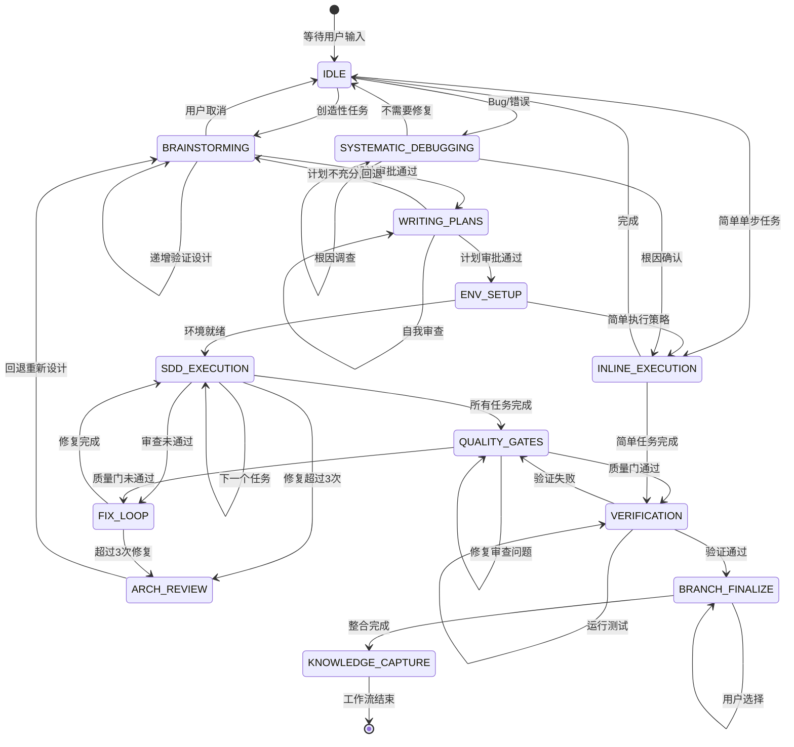
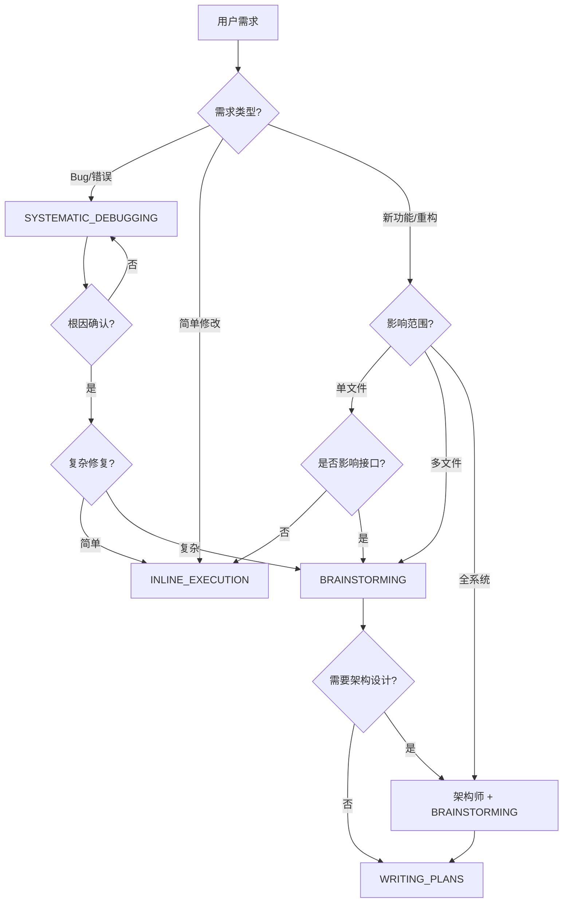

---

alwaysApply: false
description: 开发全流程规范——角色指令、工作流状态机、Skill协作、质量门控、异常处理与裁剪指南的统一手册。
---

# 开发流程规范

> **打开时机**：需要查阅角色指令、走流程、做Skill决策、查质量门控时打开。—— **统一参考手册**。

本文档合并原《指令手册》《协作链路》《Skills协作》《完整流程调用规范》四份文档，消除重复、补充状态机与门控体系。

***

## 1. 核心原则

### 1.1 六大核心原则

| # | 原则        | 含义                                   |
| - | --------- | ------------------------------------ |
| 1 | **先想后做**  | 任何实现前必须完成头脑风暴→设计→计划，禁止跳过             |
| 2 | **智能体优先** | 每个任务委派给专门的SubAgent，利用全新上下文避免污染       |
| 3 | **测试驱动**  | Red-Green-Refactor是不可协商的铁律           |
| 4 | **安全第一**  | 安全检查嵌入每个审查环节                         |
| 5 | **证据驱动**  | 没有验证就没有声明，没有根因调查就没有修复                |
| 6 | **方法论先行** | 全局Skill决定"怎么想"，项目Skill决定"怎么做"，思考先于执行 |

### 1.2 协作黄金法则

1. **串联叠加** — 全局Skill与项目Skill是串联叠加关系，不是互斥替代
2. **跨切面嵌入** — verification-before-completion、TDD等叠加在所有项目Skill之上
3. **准入门槛** — 项目Skill有前置条件，不满足时先回退到上游全局Skill补齐
4. **紧急不跳方法论** — 紧急场景可压缩流程，但方法论铁律不可违反

### 1.3 全局Skill铁律

| Skill                          | 铁律               | 违反后果        |
| ------------------------------ | ---------------- | ----------- |
| brainstorming                  | 不经设计批准，不写任何代码    | 方向错误、返工     |
| test-driven-development        | 没有失败测试，不写生产代码    | 测试覆盖不足      |
| systematic-debugging           | 没有根因调查，不提任何修复    | 修复无效、引入新Bug |
| verification-before-completion | 没有新鲜验证证据，不做完成声称  | 虚假完成、质量失控   |
| writing-plans                  | 每步必须包含实际内容，禁止占位符 | 计划无法执行      |

### 1.4 调用优先级

```
用户指令 → 检查是否有相关Skill → 先检查全局Skill（方法论）→ 再调用项目Skill（执行）
```

1. **流程型全局Skill**（brainstorming、systematic-debugging）— 决定如何切入问题
2. **实施型全局Skill**（writing-plans、TDD）— 指导如何执行
3. **项目Skill** — 按标准化流程交付
4. **质量守门型全局Skill**（verification-before-completion）— 最终验证

***

## 2. 角色与指令定义

### 2.1 角色矩阵

| 角色        | 核心职责                     | 关键交付物                               |
| --------- | ------------------------ | ----------------------------------- |
| **产品经理**  | 产品规划、价值验收                | 商业需求文档（BRD）、市场需求文档（MRD）、产品需求文档（PRD） |
| **架构师**   | 架构设计、任务拆解、方案评审           | 需求规格说明书、架构设计方案、任务清单                 |
| **开发工程师** | 功能开发、单元测试、Bug修复、代码优化     | 功能代码、单元测试、开发交付报告                    |
| **评审专家**  | 代码质量评审、架构一致性检查、安全审计      | 代码评审报告                              |
| **测试工程师** | 测试策略、用例设计、测试执行、质量评估      | 测试用例、测试报告、Bug清单、上线结论                |
| **发布运维**  | CICD搭建、自动化发布、FIX-CI、知识沉淀 | 流水线配置、发布报告、运维文档                     |

> 主Agent承担Coordinator职责：工作流编排、阶段转换决策、质量门控检查、异常回退处理。详细规则见 `project-rules.md`。

### 2.2 指令定义

#### 产品经理指令

| ID    | 指令   | 目的       | 输入        | 输出                        | 验收标准                 |
| ----- | ---- | -------- | --------- | ------------------------- | -------------------- |
| PM-01 | 产品规划 | 输出产品规划方案 | 市场调研、业务目标 | `/docs/product/产品规划方案.md` | 产品愿景清晰，路线图合理，版本规划可执行 |

#### 架构师指令

| ID     | 指令   | 目的          | 输入          | 输出                                  | 验收标准                |
| ------ | ---- | ----------- | ----------- | ----------------------------------- | ------------------- |
| ARC-01 | 需求分析 | 输出需求规格说明书   | 业务诉求、项目背景   | `/docs/requirements/REQ_需求规格说明书.md` | 需求无歧义，验收标准可量化       |
| ARC-02 | 架构设计 | 输出架构设计方案    | 需求规格说明书     | `/docs/architecture/架构设计说明书.md`     | 技术栈适配，接口规范完整        |
| ARC-03 | 任务拆解 | 拆解开发任务清单    | 架构设计方案      | `/docs/planning/task_list_*.md`     | 任务粒度2-8h，依赖无闭环，无占位符 |
| ARC-04 | 架构评审 | 评审架构方案技术可行性 | 架构设计方案、需求规格 | `/docs/architecture/架构评审报告.md`      | 技术选型有依据，风险已识别       |

#### 开发工程师指令

| ID     | 指令    | 目的          | 输入         | 输出                                       | 验收标准                |
| ------ | ----- | ----------- | ---------- | ---------------------------------------- | ------------------- |
| DEV-01 | 功能开发  | 完成代码开发与单元测试 | 任务清单、架构方案  | 代码 + `/tests/unit/` + self-review + 交付报告 | 单元测试通过率100%，覆盖率≥80% |
| DEV-02 | Bug修复 | 修复Bug并更新测试  | Bug清单、根因分析 | 修复代码 + 更新测试 + Bug修复报告                    | Bug复现验证通过，无新Bug引入   |
| DEV-03 | 代码优化  | 优化代码结构与性能   | 代码仓库、评审报告  | 优化代码 + 优化报告                              | 性能提升≥15%，测试全部通过     |

#### 调试工程师指令

| ID     | 指令    | 目的           | 输入         | 输出             | 验收标准          |
| ------ | ----- | ------------ | ---------- | -------------- | ------------- |
| DBG-01 | 构建修复  | 修复构建/类型/依赖错误 | 错误信息、代码仓库  | 修复代码 + 调试报告    | 构建通过，测试通过     |
| DBG-02 | TDD指导 | 指导TDD红绿重构循环  | 任务清单       | 失败测试 → 实现 → 通过 | 先有失败测试再写生产代码  |
| DBG-03 | 根因定位  | 系统化定位Bug根因   | Bug描述、复现步骤 | 根因分析报告         | 根因确认，最小验证测试通过 |

#### 代码评审工程师指令

| ID     | 指令   | 目的           | 输入             | 输出                         | 验收标准                  |
| ------ | ---- | ------------ | -------------- | -------------------------- | --------------------- |
| REV-01 | 代码评审 | 评审代码质量与架构一致性 | 代码仓库、架构方案、交付报告 | `/docs/review/代码评审报告_*.md` | 无CRITICAL/IMPORTANT问题 |

#### 测试工程师指令

| ID     | 指令   | 目的             | 输入           | 输出                         | 验收标准                  |
| ------ | ---- | -------------- | ------------ | -------------------------- | --------------------- |
| TST-01 | 测试策略 | 制定测试策略与门禁规则    | 需求规格、架构方案    | `/docs/test/strategy_*.md` | 覆盖MVP需求，准入准出可量化       |
| TST-02 | 测试执行 | 执行测试并输出报告      | 代码仓库、测试用例    | 测试报告 + Bug清单               | 用例执行率100%，核心流程通过率≥95% |
| TST-03 | 回归测试 | 验证Bug修复并给出上线结论 | Bug修复报告、修复代码 | 回归报告 + 上线结论                | P0/P1 Bug 100%修复验证    |

#### 发布运维指令

| ID     | 指令      | 目的                  | 输入            | 输出                      | 验收标准                |
| ------ | ------- | ------------------- | ------------- | ----------------------- | ------------------- |
| OPS-01 | 文档更新    | 更新用户文档和全局文档         | 上线结论、版本号、变更内容 | 更新后的文档集                 | 文档与版本内容一致           |
| OPS-02 | CICD验证  | 验证流水线正常执行           | Git分支、构建命令    | 流水线执行报告                 | 流水线自动触发，步骤无报错       |
| OPS-03 | 单人自动化发布 | 执行版本发布              | 上线结论、版本号      | 版本Tag + 发布报告            | Tag创建成功，线上服务正常      |
| OPS-04 | FIX-CI  | 修复CI构建失败            | Git分支、构建命令    | 修复配置 + FIX-CI报告         | 流水线重新执行通过           |
| OPS-05 | 文档归档    | 归档版本相关文档            | 版本号、发布报告      | 归档目录 + 清理后项目            | 版本文档已归档，项目目录整洁      |
| OPS-06 | 知识沉淀    | 提取可重用模式、更新CHANGELOG | 发布报告、开发过程文档   | 模式记录 + CHANGELOG + 会话总结 | 新模式已记录、CHANGELOG已更新 |

### 2.3 代码评审三级严重度

| 级别             | 定义          | 处理规则     | 示例                         |
| -------------- | ----------- | -------- | -------------------------- |
| **CRITICAL**   | 立即修复，阻塞后续任务 | 必须修复才能继续 | 安全漏洞、数据丢失风险、架构偏离、硬编码密钥     |
| **IMPORTANT**  | 继续前修复       | 当前任务内修复  | 错误处理缺失、类型安全违规、N+1查询、命名规范违反 |
| **SUGGESTION** | 酌情采纳        | 可延后处理    | 代码风格、文档补充、可选优化             |

### 2.4 开发工程师状态管理

开发工程师按单任务生命周期运作，交付时报告以下状态之一：

| 状态                 | 含义                    | 后续动作         |
| ------------------ | --------------------- | ------------ |
| **COMPLETE**       | 代码+测试+self-review均完成  | 进入代码评审       |
| **WITH\_CONCERNS** | 功能实现但有关注点（性能/安全/可维护性） | 标注关注点，进入代码评审 |
| **NEED\_CONTEXT**  | 缺少必要信息                | 请求协调者补充，重新执行 |
| **BLOCKED**        | 无法继续，需架构介入            | 上报协调者，架构师介入  |

### 2.5 评审反馈处理规则

收到代码评审反馈时，遵循以下规则：

1. **禁止表演性同意** — 不说"You're right!"、"Great point!"等无实质内容的赞同
2. **先验证再实现** — 技术正确性 > 社交舒适
3. **YAGNI检查** — 对"专业"建议先grep确认实际使用
4. **推回条件** — 建议会破坏现有功能 / 缺乏代码库上下文 / 违反YAGNI
5. **实施顺序** — 先澄清不明确条目，再按 阻塞问题→简单修复→复杂修复 排序

***

## 3. 工作流状态机

### 3.1 主状态转换



### 3.2 回退条件

| 触发条件       | 回退目标                | 原因         |
| ---------- | ------------------- | ---------- |
| 修复循环 > 3 次 | WRITING\_PLANS（规划）  | 任务分解或架构有问题 |
| 质量门阻塞      | FIX\_LOOP（修复）       | 继续修复直至通过   |
| 验证失败       | SDD\_EXECUTION（实现）  | 定位失败原因     |
| 用户反馈设计需修改  | BRAINSTORMING（头脑风暴） | 重新设计       |

### 3.3 并行执行决策

```
任务列表 → 任务是否独立（无共享状态）？
  NO → 串行执行
  YES → 是否 ≥ 3 个？
    NO → 串行执行
    YES → 并行调度多个SubAgent
```

***

## 4. 复杂度评估与执行策略

### 4.1 决策树



### 4.2 执行策略

| 条件        | 策略                   | 说明                             |
| --------- | -------------------- | ------------------------------ |
| 单文件、单函数修改 | **Inline Execution** | 当前会话直接执行，不委派SubAgent           |
| 2-5 个任务   | **Sequential SDD**   | Subagent-Driven，串行，每个任务后审查     |
| 3+ 个独立任务  | **Parallel SDD**     | 并行调度多个SubAgent，汇总审查            |
| 全系统重构     | **完整流程**             | brainstorming → 架构设计 → 规划 → 实现 |
| 架构/设计任务   | **最强模型Agent**        | 委派架构师（最强可用模型）                  |

### 4.3 按任务类型裁剪

| 任务类型               | 执行流程                                                         | 文档产出             |
| ------------------ | ------------------------------------------------------------ | ---------------- |
| **小优化/Bug修复**（≤半天） | systematic-debugging → TDD → verification                    | 仅代码+测试，可选Bug修复报告 |
| **中等功能**（半天\~2天）   | brainstorming（轻量）→ TDD → verification → 代码评审                 | 代码+测试+交付报告       |
| **大功能/架构变更**（>2天）  | 完整流程                                                         | 全套文档             |
| **紧急Hotfix**       | systematic-debugging（加速Phase 2-3）→ TDD → verification → 回归测试 | 修复代码+测试+回归报告     |

### 4.4 轻量链路

适用大多数迭代的5步轻量链路：

```
需求确认（产品规划+需求分析合并）
   ↓
[TDD] 功能开发（内嵌 verification）
   ↓
[verification] 代码评审
   ↓
测试执行
   ↓
发布
```

**合并规则**：

- 产品规划 + 需求分析 → **需求确认**（一条记录即可）
- 架构设计 + 架构评审 → 仅重大变更时执行
- 任务拆解 + writing-plans → 仅复杂任务保留
- 测试策略 → 仅首次或测试框架变更时
- 文档归档 → 发布时顺带完成

***

## 5. 全局Skill嵌入规范

### 5.1 Skill全景图

#### 全局Skills（方法论层）

| 分类        | Skill                          | 触发条件           | 核心产出       | 铁律            |
| --------- | ------------------------------ | -------------- | ---------- | ------------- |
| **探索设计**  | brainstorming                  | 新功能、新设计、重大变更   | 设计文档       | 不经设计批准，不写代码   |
| **探索设计**  | writing-plans                  | 有明确需求，需编写实施计划  | 实施计划文档     | 禁止占位符         |
| **开发方法论** | test-driven-development        | 编写任何功能或修复代码    | TDD循环      | 没有失败测试，不写生产代码 |
| **开发方法论** | subagent-driven-development    | 有实施计划，需在当前会话执行 | 任务逐个交付     | —             |
| **开发方法论** | executing-plans                | 有实施计划，需在独立会话执行 | 批量任务交付     | —             |
| **开发方法论** | dispatching-parallel-agents    | 3+个独立任务可并行     | 并行任务交付     | —             |
| **问题定位**  | systematic-debugging           | Bug、测试失败、异常行为  | 根因分析       | 没有根因调查，不提修复   |
| **质量保障**  | verification-before-completion | 声称完成、修复、通过之前   | 验证证据       | 没有新鲜证据，不声称完成  |
| **质量保障**  | requesting-code-review         | 完成任务、实现功能、合并前  | 评审反馈       | —             |
| **质量保障**  | receiving-code-review          | 收到评审反馈时        | 技术评估与实施    | 禁止表演性同意       |
| **Git操作** | git-pushing                    | 需要Git操作参考      | Git操作指引    | —             |
| **Git操作** | using-git-worktrees            | 需要隔离工作区        | Worktree配置 | —             |
| **Git操作** | finishing-a-development-branch | 实现完成，需决定如何集成   | 合并/PR/清理   | —             |

#### 项目Skills（执行层）

| 阶段     | Skill   | 指令ID   | 触发条件           | 核心产出              |
| ------ | ------- | ------ | -------------- | ----------------- |
| **产品** | 产品规划    | PM-01  | 需要定义产品愿景和路线图   | 产品规划方案.md         |
| **需求** | 需求分析    | ARC-01 | 需要拆解业务诉求为功能点   | REQ\_需求规格说明书.md   |
| **架构** | 架构设计    | ARC-02 | 需要设计系统架构       | 架构设计说明书.md        |
| **架构** | 架构评审    | ARC-04 | 需要评审架构可行性      | 架构评审报告.md         |
| **规划** | 任务拆解    | ARC-03 | 需要拆解开发任务清单     | task\_list\_\*.md |
| **开发** | 功能开发    | DEV-01 | 需要开发新功能或优化现有功能 | 代码+测试+交付报告        |
| **开发** | Bug修复   | DEV-02 | 需要修复Bug        | 修复代码+测试+修复报告      |
| **开发** | 代码优化    | DEV-03 | 需要优化代码结构与性能    | 优化代码+优化报告         |
| **调试** | 构建修复    | DBG-01 | 构建/类型/依赖错误     | 修复代码+调试报告         |
| **调试** | TDD指导   | DBG-02 | 需要TDD循环指导      | 失败测试→实现→通过        |
| **调试** | 根因定位    | DBG-03 | Bug根因不明        | 根因分析报告            |
| **评审** | 代码评审    | REV-01 | 需要评审代码质量       | 代码评审报告.md         |
| **测试** | 测试策略    | TST-01 | 需要制定测试策略与门禁规则  | strategy\_\*.md   |
| **测试** | 测试执行    | TST-02 | 需要执行测试         | 测试报告+Bug清单        |
| **测试** | 回归测试    | TST-03 | 需要验证Bug修复      | 回归报告+上线结论         |
| **运维** | CICD验证  | OPS-02 | 需要验证流水线        | 流水线执行报告.md        |
| **运维** | FIX-CI  | OPS-04 | CI构建失败         | 修复配置+FIX-CI报告     |
| **运维** | 单人自动化发布 | OPS-03 | 需要发布新版本        | 版本Tag+发布报告        |
| **运维** | 文档更新    | OPS-01 | 版本变更后需更新文档     | 更新后的文档集           |
| **运维** | 文档归档    | OPS-05 | 版本发布后需归档清理     | 归档目录+清理后项目        |
| **运维** | 知识沉淀    | OPS-06 | 版本发布后提取可重用模式   | 模式记录+CHANGELOG    |

### 5.2 嵌入模式

| 模式     | 说明                     | 示例                                   |
| ------ | ---------------------- | ------------------------------------ |
| **串联** | 全局Skill输出作为项目Skill输入   | brainstorming → 产品规划 → 需求分析          |
| **嵌入** | 全局Skill作为方法论内嵌于项目Skill | TDD循环嵌入功能开发过程                        |
| **守门** | 全局Skill作为质量关卡在关键节点拦截   | 功能开发 → \[verification] → 代码评审        |
| **并行** | 全局Skill协调多个项目Skill并行执行 | dispatching-parallel-agents 调度多Agent |

### 5.3 功能重叠决策矩阵

#### 需求探索阶段

| 对比维度     | brainstorming（全局） | 产品规划（项目）   | 需求分析（项目）     |
| -------- | ----------------- | ---------- | ------------ |
| **目的**   | 开放性探索，理解意图        | 定义产品愿景和路线图 | 拆解功能点、定义验收标准 |
| **适用时机** | 最早介入              | 有明确业务目标后   | 有产品规划后       |

**决策规则**：三者串联。brainstorming → 产品规划 → 需求分析。

#### 任务规划阶段

| 对比维度    | writing-plans（全局）      | 任务拆解（项目）     |
| ------- | ---------------------- | ------------ |
| **粒度**  | 5-15分钟/步，函数/文件级        | 2-8小时/任务，模块级 |
| **TDD** | 每步嵌入RED-GREEN-REFACTOR | 仅标注"需测试"标记   |

| 任务规模        | 策略                         |
| ----------- | -------------------------- |
| 小任务（< 半天）   | 仅 writing-plans，无需任务拆解     |
| 中任务（半天\~2天） | writing-plans 为主，任务拆解做简要记录 |
| 大任务（> 2天）   | 两者都用，任务拆解用于里程碑追踪           |

#### 开发方法论

TDD嵌入功能开发使用，不是替代关系。功能开发定义"做什么、交付什么"，TDD定义"怎么写每一行代码"。

#### 问题定位

- Bug根因未知 → 先systematic-debugging
- Bug根因已知 → 直接Bug修复
- 3次修复失败 → systematic-debugging质疑架构

#### 代码评审

- 使用subagent-driven-development → requesting-code-review（每任务后评审）
- 使用项目标准流程 → 代码评审（含架构一致性检查）
- 两者可组合：先用requesting-code-review做代码质量快检，再用代码评审做架构一致性深审

#### 完成验证

verification-before-completion是跨切面关注点，叠加在所有项目Skill之上。项目Skill的验证步骤是"检查清单"，verification是"证据要求"。

### 5.4 项目Skill准入条件

| 项目Skill | 必须满足的前置条件          |
| ------- | ------------------ |
| 产品规划    | 市场调研或用户反馈已提供       |
| 需求分析    | 产品规划方案已存在          |
| 架构设计    | 需求规格说明书已存在         |
| 架构评审    | 架构设计方案+需求规格已存在     |
| 任务拆解    | 架构设计方案已存在          |
| 功能开发    | 任务清单+架构方案已存在       |
| Bug修复   | Bug清单已存在           |
| 代码优化    | 代码仓库可访问            |
| 代码评审    | 代码新提交+架构方案+交付报告已存在 |
| 测试策略    | 需求规格+架构方案已存在       |
| 测试执行    | 代码仓库+测试用例已存在       |
| 回归测试    | Bug修复报告已存在         |
| CICD验证  | Git分支+构建命令已提供      |
| 单人自动化发布 | 回归报告+版本号+main分支    |

***

## 6. 质量门控体系

### 6.1 五层门控

```
Gate 1: PRE-IMPLEMENTATION          Gate 4: POST-IMPLEMENTATION
┌──────────────────────┐            ┌──────────────────────┐
│ 规格审批 ✓           │            │ 全量测试 ≥80% ✓      │
│ 计划审批 ✓           │            │ Lint 通过 ✓          │
│ 环境隔离 ✓           │            │ 安全审查通过 ✓        │
│ 实施计划已编写 ✓     │            │ 文档更新 ✓           │
└──────────┬───────────┘            └──────────┬───────────┘
           │                                    │
       ┌───┴───┐                           ┌────┴────┐
       │实现阶段│                           │质量门控  │
       └───┬───┘                           └────┬────┘
           │                                    │
Gate 2: IN-IMPLEMENTATION          Gate 5: PRE-MERGE
┌──────────────────────┐            ┌──────────────────────┐
│ TDD循环完成 ✓        │            │ 验证证据新鲜 ✓       │
│ Self-review完成 ✓    │            │ PR描述完整 ✓         │
│ Code-review通过 ✓    │            │ 分支可合并 ✓         │
│ 修复次数 ≤3 ✓       │            │ 所有审查通过 ✓       │
└──────────┬───────────┘            └──────────────────────┘
           │
Gate 3: VERIFICATION
┌──────────────────────┐
│ 测试套件通过 ✓       │
│ 验收测试通过 ✓       │
│ 构建成功 ✓           │
│ 禁止推测性声明 ✓     │
└──────────────────────┘
```

### 6.2 禁止语言

| 禁止                          | 替代                          |
| --------------------------- | --------------------------- |
| "should work"               | "验证通过: \[输出摘录]"             |
| "probably fine"             | "测试结果: 42 passed, 0 failed" |
| "seems to pass"             | "构建成功: exit code 0"         |
| "Great!"/"Perfect!"/"Done!" | 在验证完成前禁止任何满意表达              |

### 6.3 证据新鲜度

验证证据的执行时间必须 < 5分钟。超过5分钟的验证结果视为过期，需重新执行。

***

## 7. 异常处理与回退

| 异常场景        | 处理方式                     | 责任人   | 回退                            |
| ----------- | ------------------------ | ----- | ----------------------------- |
| 产品方向不明确     | 重新定义产品愿景                 | 产品经理  | brainstorming                 |
| 需求理解有歧义     | 逐个提问澄清                   | 架构师   | brainstorming                 |
| 本地调试多次失败    | 输出调试报告                   | 调试工程师 | systematic-debugging          |
| Bug修复3次仍失败  | 停止修复，质疑架构                | 架构师   | 回退WRITING\_PLANS              |
| CICD流水线连续失败 | 同步架构师、测试工程师共同分析          | 发布运维  | FIX-CI → systematic-debugging |
| 架构评审不通过     | 按评审报告整改后重新提交             | 架构师   | —                             |
| 代码评审不通过     | 按评审报告整改后重新提交             | 开发工程师 | receiving-code-review         |
| 测试通过率<95%   | 优先修复失败用例                 | 调试工程师 | systematic-debugging          |
| CICD配置型错误   | 直接修复workflow文件           | 发布运维  | FIX-CI                        |
| CICD代码型错误   | 停止，转systematic-debugging | 调试工程师 | → Bug修复                       |
| 安全漏洞高危      | 立即修复                     | 开发工程师 | —                             |

***

## 8. 反模式防御

### 8.1 十二种理性化陷阱

| #  | 借口           | 现实             | 防御机制                           |
| -- | ------------ | -------------- | ------------------------------ |
| 1  | "这只是一个简单修复"  | 简单修复也可能引入回归    | 强制TDD + systematic-debugging   |
| 2  | "让我先探索代码库"   | 无目标探索浪费上下文     | 明确搜索目标后再探索                     |
| 3  | "我稍后再写测试"    | "稍后"永远不会到来     | TDD铁律，不可推迟                     |
| 4  | "这个设计很直观"    | 直觉≠正确，需要验证     | brainstorming递增验证              |
| 5  | "我确定它工作"     | 没有验证就没有确定      | verification-before-completion |
| 6  | "上次也是这么做的"   | 上下文不同，每个任务独立评估 | 每个任务独立评估                       |
| 7  | "时间不够了"      | 跳过流程更慢         | 短期主义陷阱识别                       |
| 8  | "这只是临时代码"    | 临时=永久          | 所有代码遵循相同标准                     |
| 9  | "用户/审查员说的对"  | 技术正确性>社交舒适     | receiving-code-review规则        |
| 10 | "让我跳过规划直接编码" | 没有计划更容易出错      | brainstorming HARD-GATE        |
| 11 | "测试通过了所以没问题" | 可能测试本身有问题      | 检查测试质量                         |
| 12 | "先合并，问题后面修"  | 技术债务累积         | 质量门控不可绕过                       |

### 8.2 RED FLAGS（立即停止信号）

| 场景 | RED FLAG                        | 动作             |
| -- | ------------------------------- | -------------- |
| 调试 | 开始提出解决方案而非问题                    | 停止，回到根因调查      |
| 调试 | 没有进行数据流追踪                       | 停止，追踪数据流       |
| 调试 | 已有3次以上修复尝试                      | 停止，回退规划阶段      |
| 开发 | 提交代码前未写测试                       | 停止，先写失败测试      |
| 开发 | 测试在实现后编写                        | 停止，重做TDD循环     |
| 开发 | 测试立即通过（RED阶段）                   | 检查测试是否真正验证了行为  |
| 规划 | 计划中出现TBD/TODO                   | 停止，补充实际内容      |
| 评审 | 表达"You're right!"等表演性同意         | 停止，先验证建议的技术正确性 |
| 验证 | 声称"should work"/"probably fine" | 停止，必须出示验证证据    |

***

## 9. 速查表

### 9.1 快速决策口诀

- 想不清楚 → 全局Skill（brainstorming / debugging）
- 知道做什么但不知道怎么做 → 全局Skill（writing-plans / TDD）
- 知道怎么做且需要交付 → 项目Skill
- 声称完成 → 全局Skill（verification-before-completion）

### 9.2 五维决策框架

| 维度       | 选全局Skill的信号 | 选项目Skill的信号  |
| -------- | ----------- | ------------ |
| **需求性质** | 需求模糊、需探索    | 需求明确、需执行     |
| **输出要求** | 需要思考过程、方案对比 | 需要标准化文档、合规交付 |
| **项目依赖** | 不依赖项目文档结构   | 依赖项目文档链路     |
| **质量要求** | 需要方法论保障     | 需要流程保障       |
| **团队协作** | 个人思考、设计决策   | 团队对齐、交付验收    |

### 9.3 时效规则

| 场景            | 响应时效 | 处理时效      |
| ------------- | ---- | --------- |
| 产品方向重大变更      | 立即   | 1工作日内调整规划 |
| 架构评审反馈        | 2工时内 | 1工作日内整改   |
| 代码评审反馈        | 2工时内 | 4工时内整改    |
| 测试反馈P0/P1级Bug | 2工时内 | 4工时内修复    |
| CICD流水线失败     | 1工时内 | 2工时内修复    |
| 安全测试高危漏洞      | 立即   | 4工时内修复    |

> 单人模式下按实际优先级自行安排，但P0级安全/Bug问题应立即处理。

***

*文档版本: v4.0.0 | 更新日期: 2026-07-18 | 合并自：指令手册v2.5 + 协作链路v3.2 + Skills协作v1.2 + 完整流程调用规范v1.0*
