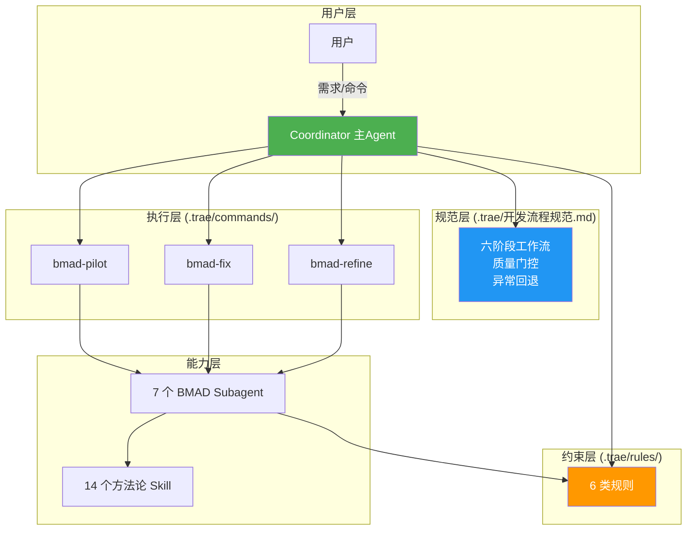
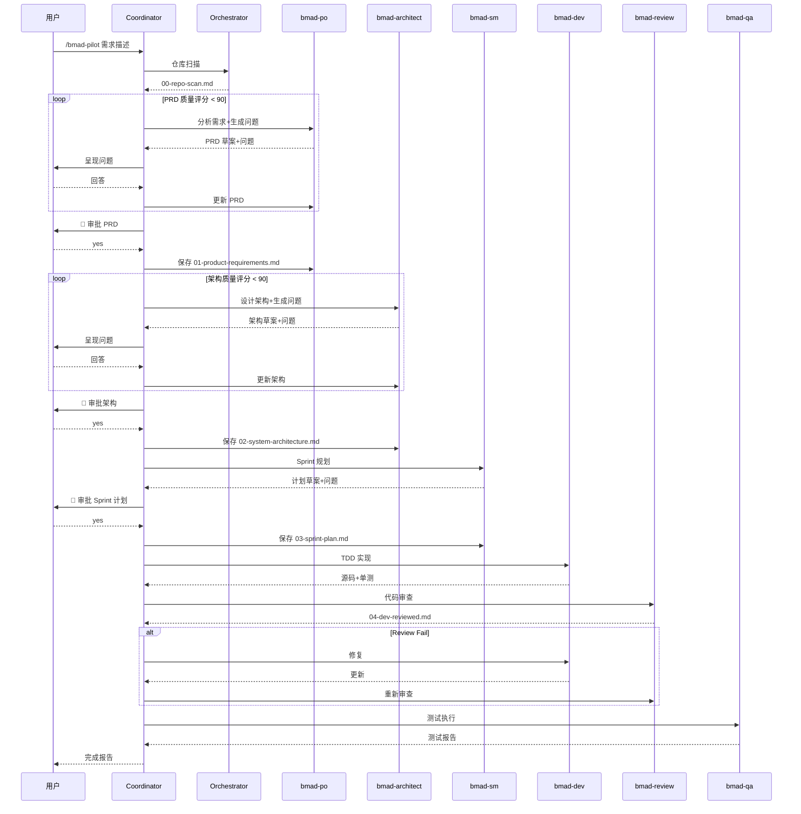
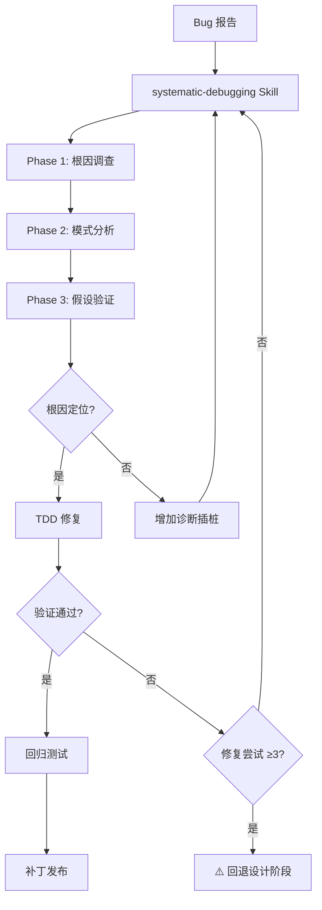
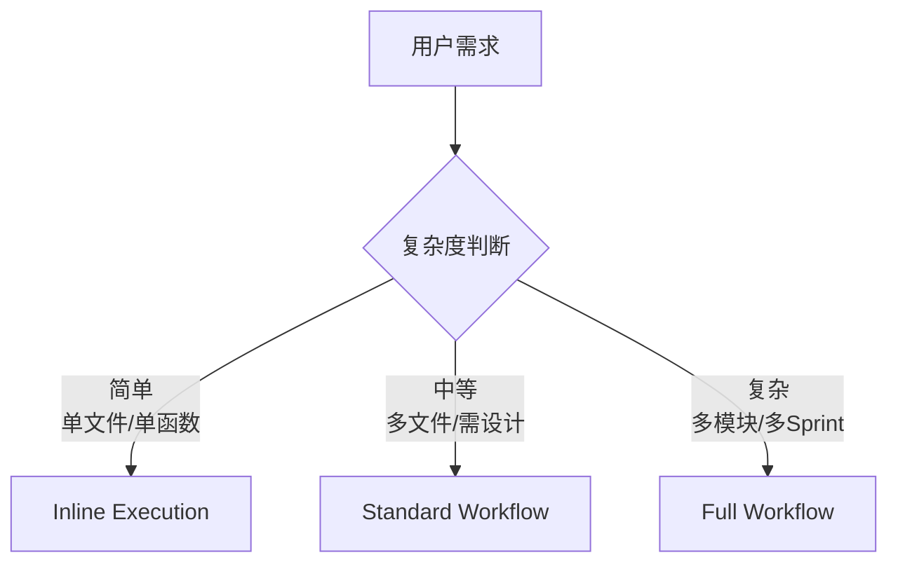
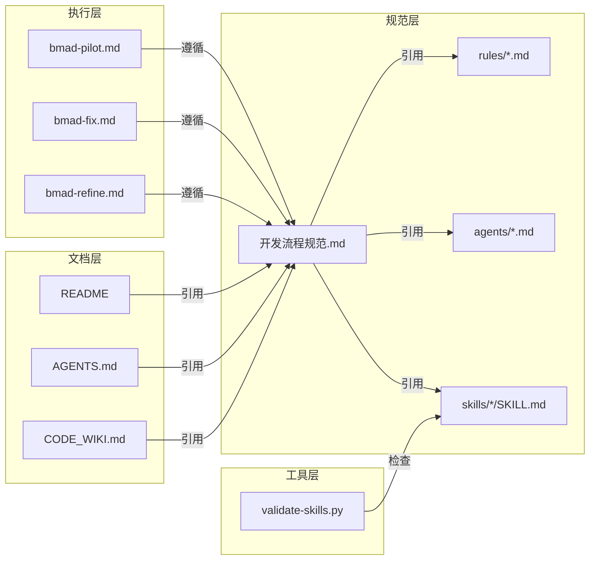

# Code Wiki — Trae 敏捷开发规范与工作流

> **版本**: v2.0.0 | **许可证**: MIT
> 最后更新: 2026-07-23

---

## 目录

1. [项目概述](#1-项目概述)
2. [整体架构](#2-整体架构)
3. [目录结构与文件清单](#3-目录结构与文件清单)
4. [核心模块详解](#4-核心模块详解)
   - 4.1 [Coordinator 与 Orchestrator 中介模式](#41-coordinator-与-orchestrator-中介模式)
   - 4.2 [BMAD 智能体体系](#42-bmad-智能体体系)
   - 4.3 [六阶段工作流](#43-六阶段工作流)
   - 4.4 [质量门控体系](#44-质量门控体系)
   - 4.5 [快捷命令](#45-快捷命令)
   - 4.6 [规则体系](#46-规则体系)
   - 4.7 [方法论 Skill 体系](#47-方法论-skill-体系)
5. [数据流与处理流程](#5-数据流与处理流程)
6. [依赖关系](#6-依赖关系)
7. [项目运行方式](#7-项目运行方式)
8. [开发规范与约定](#8-开发规范与约定)

---

## 1. 项目概述

本项目是一套**针对 Trae CN IDE（SOLO Agent 模式）的 Agentic AI 编程敏捷开发规范与工作流定义**。它不是传统的代码仓库，而是一套方法论体系，通过规范层、执行层、能力层、约束层的协同，让 AI Agent 能够以工程化方式完成软件开发全生命周期。

### 1.1 核心定位

- **目标**: 在 Trae CN SOLO Agent 环境下，实现高效协作、快速迭代、质量可控的 Agentic AI 编程
- **核心产物**: 角色体系 + 全流程工作流 + 质量门控 + 快捷命令 + 方法论 Skill
- **适用环境**: Trae CN IDE（SOLO Agent 模式）

### 1.2 技术栈

| 层级 | 技术 | 说明 |
|------|------|------|
| 运行环境 | Trae CN IDE | SOLO Agent 模式 |
| 智能体定义 | Markdown + YAML frontmatter | `.trae/agents/*.md` |
| 方法论 Skill | Markdown | `.trae/skills/*/SKILL.md` |
| E2E 测试 | Playwright MCP | bmad-qa 启用 |
| 验证脚本 | Python 3.6+ | `scripts/validate-skills.py` |
| 版本控制 | Git + GitHub | 协作与发布 |

---

## 2. 整体架构



### 2.1 架构分层

| 层 | 职责 | 关键目录/文件 |
|----|------|--------------|
| **规范层** | 定义工作流状态机、门控、异常处理 | `.trae/开发流程规范.md` |
| **执行层** | 快捷命令驱动流程 | `.trae/commands/` |
| **能力层** | 智能体 + 方法论 Skill | `.trae/agents/`、`.trae/skills/` |
| **约束层** | 规则体系（安全/合规/质量/流程/YAGNI） | `.trae/rules/` |
| **工具层** | Skill 验证 | `scripts/validate-skills.py` |
| **文档层** | 开发指南、模板 | `docs/` |

---

## 3. 目录结构与文件清单

```
trae-agent-skills/
│
├── .trae/                              # 方法论体系（核心内容）
│   ├── agents/                         # 7 个 BMAD Subagent
│   │   ├── bmad-architect.md           # 架构师（最强模型，禁用 Edit）
│   │   ├── bmad-dev.md                 # 开发工程师（TDD 实现）
│   │   ├── bmad-orchestrator.md        # 仓库扫描（只读）
│   │   ├── bmad-po.md                  # 产品经理（PRD+评分）
│   │   ├── bmad-qa.md                  # 测试工程师（Playwright）
│   │   ├── bmad-review.md              # 代码审查（禁用 Edit）
│   │   └── bmad-sm.md                  # Scrum Master（Sprint 规划）
│   ├── commands/                       # 3 个快捷命令
│   │   ├── bmad-pilot.md              # 完整开发流程
│   │   ├── bmad-fix.md                # Bug 修复流程
│   │   └── bmad-refine.md             # 精炼 PRD/架构/计划
│   ├── rules/                          # 6 类规则
│   │   ├── project-rules.md           # 项目规则（含 Coordinator 规则）
│   │   ├── security-rules.md          # 安全规则
│   │   ├── compliance-rules.md        # 合规规则
│   │   ├── quality-rules.md           # 质量规则
│   │   ├── process-rules.md           # 流程规则
│   │   └── ponytail.md                # YAGNI / 简洁性原则
│   ├── skills/                         # 14 个方法论 Skill
│   │   ├── brainstorming/
│   │   ├── writing-plans/
│   │   ├── test-driven-development/
│   │   ├── systematic-debugging/
│   │   ├── subagent-driven-development/
│   │   ├── dispatching-parallel-agents/
│   │   ├── executing-plans/
│   │   ├── requesting-code-review/
│   │   ├── receiving-code-review/
│   │   ├── verification-before-completion/
│   │   ├── using-git-worktrees/
│   │   ├── finishing-a-development-branch/
│   │   ├── writing-skills/
│   │   └── using-superpowers/
│   ├── 开发流程规范.md                  # 统一流程手册（37KB）
│   ├── mcp.json                        # MCP 配置
│   └── skill-config.json               # Skill 配置
│
├── docs/                               # 开发文档
│   ├── SKILL_DEVELOPMENT_GUIDE.md      # Skill 开发指南
│   └── SKILL_TEMPLATE.md               # Skill 模板
│
├── scripts/                            # 工具脚本
│   └── validate-skills.py              # Skill 验证工具
│
├── .github/                            # GitHub 协作模板
├── .gitignore
├── AGENTS.md                           # 项目说明（GitHub 自动渲染）
├── CHANGELOG.md                        # 项目更新日志
├── CODE_WIKI.md                        # 本文件（架构 Wiki）
├── CONTRIBUTING.md                     # 贡献指南
├── LICENSE                             # MIT 许可证
└── README.md                           # 项目主文档
```

### 3.1 关键文件角色

| 文件 | 角色 | 读者 |
|------|------|------|
| `README.md` | 项目入口，快速开始 | 所有用户 |
| `AGENTS.md` | 项目总览与智能体体系 | AI Agent / 用户 |
| `CODE_WIKI.md` | 架构级 Wiki | 维护者 |
| `CONTRIBUTING.md` | 贡献流程与开发规范 | 贡献者 |
| `CHANGELOG.md` | 项目级版本变更 | 所有人 |
| `.trae/开发流程规范.md` | 六阶段工作流权威定义 | Coordinator / Agent |
| `.trae/commands/*.md` | 可执行命令脚本 | Coordinator |
| `.trae/agents/*.md` | Subagent 行为定义 | SOLO Agent 调度器 |
| `.trae/rules/*.md` | 各类约束规则 | 所有 Agent |

---

## 4. 核心模块详解

### 4.1 Coordinator 与 Orchestrator 中介模式

项目采用**双中介模式**：

```
用户 ↔ Coordinator（主 Agent） ↔ Subagent（PO/Architect/SM/Dev/Review/QA）
```

#### Coordinator 职责

| 职责 | 说明 |
|------|------|
| 工作流编排 | 按六阶段顺序推进，阶段间转换决策 |
| 复杂度判断 | 用决策树选择 Inline / Standard / Full 策略 |
| 质量门控 | 在 4 个关键节点执行检查，未通过即回退 |
| 用户中介 | 所有 Subagent 不直接与用户交互，问答通过 Coordinator 中转 |
| 异常回退 | 修复循环 ≥3 次未解决时回退规划阶段 |

#### 文件保存时机策略

交互阶段（PO/Architect/SM）遵循"暂不保存直到审批"原则：

| 阶段 | 操作 | 说明 |
|------|------|------|
| 产出阶段 | Subagent 分析并生成内容 | **不保存文件**，仅返回内容 |
| 呈现阶段 | Coordinator 呈现摘要给用户 | 用户了解但不决定 |
| 审批阶段 | 用户确认 | 显式回复 "yes/是/确认/继续" |
| 保存阶段 | Coordinator 指示 Subagent 保存 | 文件落盘到 `docs/specs/{feature_name}/` |
| 例外 | 仓库扫描报告 `00-repo-scan.md` | 自动保存，无需审批 |

### 4.2 BMAD 智能体体系

7 个 Subagent 按模型分层与权限隔离设计：

| Agent | 模型 | 职责 | disallowedTools | mcpServers |
|-------|------|------|-----------------|------------|
| [bmad-orchestrator](file:///d:/yecll/Documents/LocalCode/testskills/.trae/agents/bmad-orchestrator.md) | GLM-5.2 | 仓库扫描、上下文准备 | Edit, DeleteFile | — |
| [bmad-po](file:///d:/yecll/Documents/LocalCode/testskills/.trae/agents/bmad-po.md) | Doubao-Seed-2.1-Pro | 需求收集、PRD、质量评分 | — | — |
| [bmad-architect](file:///d:/yecll/Documents/LocalCode/testskills/.trae/agents/bmad-architect.md) | Doubao-Seed-2.1-Pro | 架构设计、技术选型 | Edit | — |
| [bmad-sm](file:///d:/yecll/Documents/LocalCode/testskills/.trae/agents/bmad-sm.md) | GLM-5.2 | Sprint 规划、任务拆解 | — | — |
| [bmad-dev](file:///d:/yecll/Documents/LocalCode/testskills/.trae/agents/bmad-dev.md) | GLM-5.2 | 功能实现、TDD、Bug 修复 | — | — |
| [bmad-review](file:///d:/yecll/Documents/LocalCode/testskills/.trae/agents/bmad-review.md) | Doubao-Seed-2.1-Pro | 代码审查、合规检查 | Edit | — |
| [bmad-qa](file:///d:/yecll/Documents/LocalCode/testskills/.trae/agents/bmad-qa.md) | GLM-5.2 | 测试策略、执行、回归 | — | mcp_Playwright |

#### 模型选择策略

| 任务复杂度 | 推荐模型 | 典型场景 |
|-----------|---------|---------|
| 机械实现 | 快速模型（Doubao-Seed-2.1-Turbo） | CRUD、数据模型 |
| 集成判断 | 标准模型（GLM-5.2） | API 集成、组件交互 |
| 架构设计 | 最强模型（Doubao-Seed-2.1-Pro） | 架构决策、Review、调试 |

#### 权限隔离设计

- **Architect / Review 禁用 Edit**：这两个角色产出文档而非代码，禁用 Edit 防止越权修改实现
- **Orchestrator 禁用 Edit + DeleteFile**：仓库扫描角色应严格只读
- **QA 启用 Playwright MCP**：与"E2E 测试优先 Playwright"原则一致

### 4.3 六阶段工作流

详细定义见 [开发流程规范.md §4](file:///d:/yecll/Documents/LocalCode/testskills/.trae/开发流程规范.md)。

| 阶段 | 主导 Agent | 产出物 | 门控 |
|------|-----------|--------|------|
| 1. 需求分析 | bmad-po | `01-product-requirements.md` | PRD 质量 ≥90 + 用户审批 |
| 2. 设计 | bmad-architect + bmad-sm | `02-system-architecture.md` / `03-sprint-plan.md` | 架构质量 ≥90 + 用户审批 |
| 3. 开发 | bmad-dev + bmad-review | 源码 + 单测 + `04-dev-reviewed.md` | TDD 循环 + Review 通过 |
| 4. 测试 | bmad-qa | 测试报告 | 测试套件通过 + 覆盖率达标 |
| 5. 部署 | Coordinator | 发布包 + CHANGELOG | CI/CD 通过 + 版本号一致 |
| 6. 维护 | bmad-dev | 修复 + 回归测试 | 根因定位 + 修复验证 |

#### 三种执行策略

| 策略 | 适用 | 流程 | 交互频率 |
|------|------|------|---------|
| **Inline Execution** | Bug 修复、单函数、配置变更 | brainstorming(简) → TDD → verify | 低（1-2 次） |
| **Standard Workflow** | 新功能、多文件变更 | brainstorming → writing-plans → SDD → review | 中（3-4 次） |
| **Full Workflow** | 大型项目、多 Sprint、跨模块 | 完整六阶段 | 高（6+ 次） |

### 4.4 质量门控体系

四道门控贯穿全流程：

| 门控 | 时机 | 检查项 | 未通过处理 |
|------|------|--------|-----------|
| **门控1：实现前** | PRD + 架构 + 计划审批后 | 规格审批 ✓ 计划审批 ✓ 环境隔离 ✓ | 补充规格/计划，创建 worktree |
| **门控2：实现中** | 开发阶段 | TDD 循环 ✓ self-review ✓ Review 通过 ✓ | 返回 Dev 修复 |
| **门控3：验证前** | 测试阶段 | 测试套件通过 ✓ 构建 ✓ Lint/TypeCheck ✓ | 修复后重试 |
| **门控4：合并前** | 部署阶段 | 验证证据新鲜（<5min）✓ Review 通过 ✓ 安全扫描 ✓ | 阻止合并 |

### 4.5 快捷命令

| 命令 | 文件 | 用途 | 选项 |
|------|------|------|------|
| `/bmad-pilot` | [bmad-pilot.md](file:///d:/yecll/Documents/LocalCode/testskills/.trae/commands/bmad-pilot.md) | 完整开发流程 | `--skip-tests` / `--direct-dev` / `--skip-scan` |
| `/bmad-fix` | [bmad-fix.md](file:///d:/yecll/Documents/LocalCode/testskills/.trae/commands/bmad-fix.md) | Bug 修复 | `--direct-fix` / `--skip-regression` |
| `/bmad-refine` | [bmad-refine.md](file:///d:/yecll/Documents/LocalCode/testskills/.trae/commands/bmad-refine.md) | 精炼规格 | `--feature <name>` / `--skip-approval` |

### 4.6 规则体系

6 类规则，分 `alwaysApply` 和按需触发两类：

| 规则文件 | 触发方式 | 职责 |
|---------|---------|------|
| [project-rules.md](file:///d:/yecll/Documents/LocalCode/testskills/.trae/rules/project-rules.md) | alwaysApply | 协同黄金法则、Coordinator 规则、规则索引 |
| [security-rules.md](file:///d:/yecll/Documents/LocalCode/testskills/.trae/rules/security-rules.md) | 按需 | 输入验证、敏感数据保护、访问控制 |
| [compliance-rules.md](file:///d:/yecll/Documents/LocalCode/testskills/.trae/rules/compliance-rules.md) | 按需 | 代码审计、许可证检查、数据隐私 |
| [quality-rules.md](file:///d:/yecll/Documents/LocalCode/testskills/.trae/rules/quality-rules.md) | 按需 | 测试覆盖、代码规范、文档完整 |
| [process-rules.md](file:///d:/yecll/Documents/LocalCode/testskills/.trae/rules/process-rules.md) | 按需 | 开发过程、分支策略、审批流程 |
| [ponytail.md](file:///d:/yecll/Documents/LocalCode/testskills/.trae/rules/ponytail.md) | alwaysApply | YAGNI 原则、代码简洁性、懒 senior dev 模式 |

### 4.7 方法论 Skill 体系

14 个方法论 Skill 覆盖全生命周期：

| 阶段 | Skill | 用途 |
|------|-------|------|
| 需求/设计 | `brainstorming` | 需求与方案探索 |
| 设计 | `writing-plans` | 实施计划编写 |
| 开发 | `test-driven-development` | TDD 铁律（RED→GREEN→REFACTOR） |
| 开发 | `subagent-driven-development` | 逐任务派发 + Review |
| 开发 | `dispatching-parallel-agents` | 独立任务并行 |
| 开发 | `executing-plans` | 计划执行 |
| 开发 | `using-git-worktrees` | 工作区隔离 |
| 开发 | `finishing-a-development-branch` | 分支完成与合并 |
| 审查 | `requesting-code-review` | 审查请求 |
| 审查 | `receiving-code-review` | 审查反馈处理 |
| 测试 | `verification-before-completion` | 完成前强制验证 |
| 维护 | `systematic-debugging` | 根因定位四阶段 |
| 元 | `writing-skills` | Skill 编写规范 |
| 元 | `using-superpowers` | Skill 发现与使用 |

---

## 5. 数据流与处理流程

### 5.1 完整开发流程（Full Workflow）



### 5.2 Bug 修复流程



### 5.3 复杂度决策树



---

## 6. 依赖关系

### 6.1 文件级依赖关系



### 6.2 外部依赖

| 依赖 | 用途 | 必需? |
|------|------|-------|
| Trae CN IDE | SOLO Agent 运行环境 | ✅ |
| Playwright MCP | bmad-qa E2E 测试 | ❌（仅 QA 阶段） |
| Python 3.6+ | validate-skills.py | ❌（仅验证时） |

---

## 7. 项目运行方式

### 7.1 环境准备

```powershell
# 克隆仓库
git clone https://github.com/yecllsl/trae-agent-skills.git
cd trae-agent-skills
```

### 7.2 启动完整开发流程

在 Trae CN IDE 中输入：

```
/bmad-pilot 添加一个用户认证模块，支持 JWT 和 OAuth2
```

Coordinator 将自动编排六阶段流程。

### 7.3 Bug 修复

```
/bmad-fix 登录接口在并发场景下偶发 500 错误
```

### 7.4 精炼已有规格

```
/bmad-refine prd --feature user-auth
```

### 7.5 验证 Skill 结构

```powershell
# 验证所有 Skills
python scripts/validate-skills.py

# 详细模式
python scripts/validate-skills.py -v

# 验证指定 Skill
python scripts/validate-skills.py -s test-driven-development
```

---

## 8. 开发规范与约定

### 8.1 命名规范

| 类型 | 规范 | 示例 |
|------|------|------|
| Agent 文件 | `bmad-<role>.md` | `bmad-architect.md` |
| Skill 目录 | kebab-case | `test-driven-development` |
| 脚本文件 | snake_case | `validate_skills.py` |
| feature_name | kebab-case | `user-auth` |
| 产出文件 | `NN-name.md`（序号） | `01-product-requirements.md` |
| Commit | `Add skill: name vX.X.X` / `docs: ...` | — |

### 8.2 Agent 定义规范

YAML frontmatter 关键字段：

```yaml
---
name: bmad-<role>              # 唯一标识
description: <场景描述>         # SOLO Agent 据此判断何时调用
model: <modelName>             # 可选，指定模型
tools: <tool1>, <tool2>        # 可选，限制可用工具
disallowedTools: <tool>        # 可选，禁止使用的工具
mcpServers:                    # 可选，允许调用的 MCP Server
  - <mcpServerName>
---
```

### 8.3 Skill 目录强制要求

每个 Skill 目录必须包含：
- `SKILL.md` — 含 YAML frontmatter（name + description）+ 5 个必需章节（Purpose/Prerequisites/Usage/Architecture/Error Handling）
- `scripts/` 目录，含至少一个可执行脚本

### 8.4 核心设计原则

| 原则 | 说明 |
|------|------|
| **Rules 先行** | 任何操作前检查规则约束 |
| **Skills 指导** | 根据任务类型激活对应 Skill |
| **Subagents 执行** | 复杂任务委派专业代理，主 Agent 仅协调 |
| **Rules 验证** | 产出必须通过规则检查才可流转 |
| **长任务优先** | 每阶段封装为长任务，减少 LLM 交互中断 |
| **证据驱动** | 声称完成必须有验证证据 |
| **Orchestrator 中介** | Subagent 不直接与用户交互 |

### 8.5 .gitignore 关键规则

| 类别 | 忽略模式 | 原因 |
|------|---------|------|
| 敏感文件 | `*.pem`, `*.key`, `.env`, `credentials.json` | 安全 |
| 运行时目录 | `.trae/cache/`, `.trae/logs/` | 临时文件 |
| Python | `__pycache__/`, `.venv/`, `*.egg-info/` | 构建产物 |

---

> **经验总结**: 本项目的核心设计思想是"规范即代码"——通过 Markdown 文档定义工作流状态机、YAML frontmatter 配置 Agent 行为、Skill 封装方法论，让 AI Agent 能够以工程化、可审计、可回退的方式完成软件开发全生命周期。所有规范都可被 Trae CN IDE 直接加载执行，无需额外运行时。
