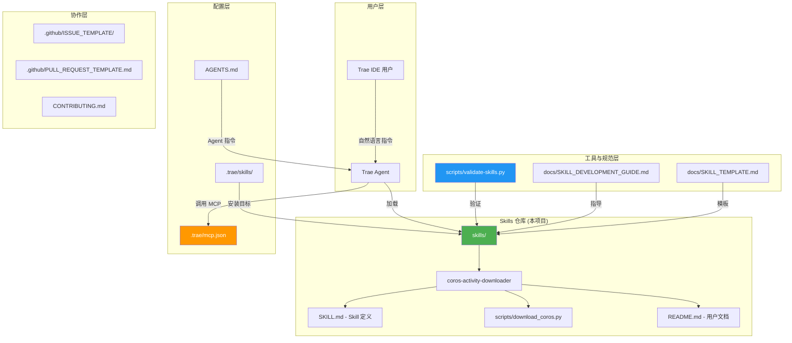
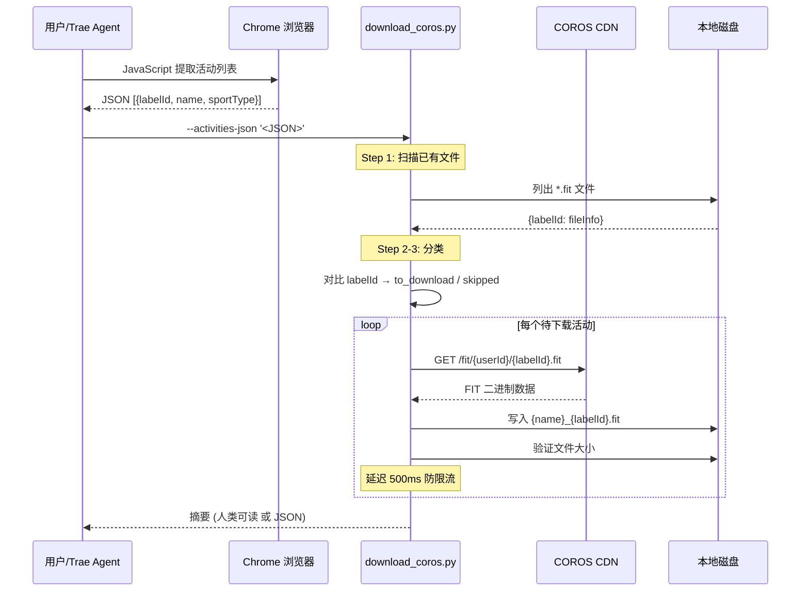
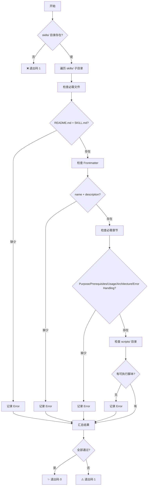
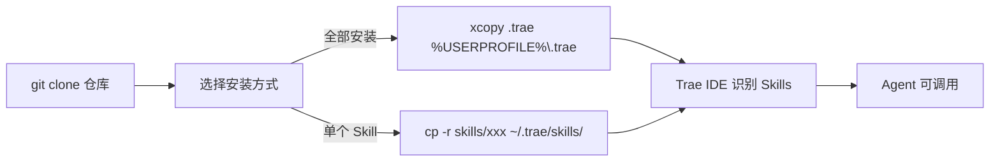
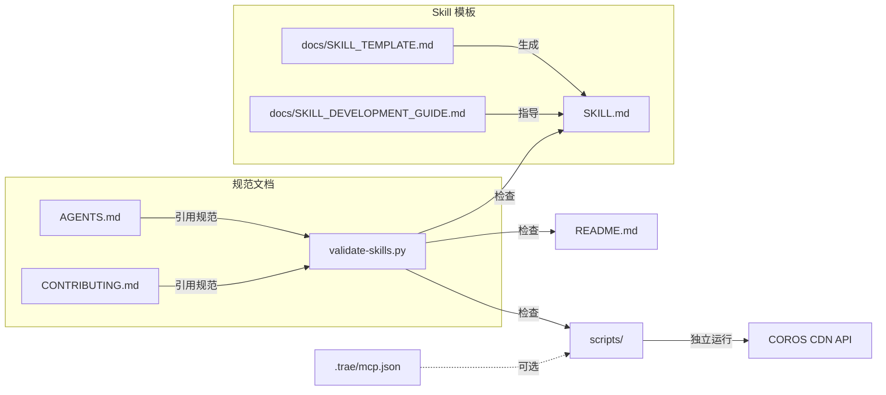

# Code Wiki — trae-agent-skills

> **版本**: v1.0.0 | **许可证**: MIT | **Python**: 3.6+  
> 最后更新: 2026-05-14

---

## 目录

1. [项目概述](#1-项目概述)
2. [整体架构](#2-整体架构)
3. [目录结构与文件清单](#3-目录结构与文件清单)
4. [核心模块详解](#4-核心模块详解)
   - 4.1 [Skill: coros-activity-downloader](#41-skill-coros-activity-downloader)
   - 4.2 [验证脚本: validate-skills.py](#42-验证脚本-validate-skills-py)
   - 4.3 [文档模块: docs/](#43-文档模块-docs)
   - 4.4 [GitHub 协作模板: .github/](#44-github-协作模板-github)
   - 4.5 [Trae IDE 配置: .trae/](#45-trae-ide-配置-trae)
5. [关键类与函数详解](#5-关键类与函数详解)
6. [数据流与处理流程](#6-数据流与处理流程)
7. [依赖关系](#7-依赖关系)
8. [项目运行方式](#8-项目运行方式)
9. [开发规范与约定](#9-开发规范与约定)

---

## 1. 项目概述

**trae-agent-skills** 是一个面向 [Trae IDE](https://www.trae.ai/) 的 Agent Skills 集合仓库。它通过预定义的指令和脚本扩展 AI 助手的功能能力，使 Trae Agent 能够执行特定的自动化任务。

### 1.1 核心定位

- **目标用户**: Trae IDE 使用者、Skill 开发者
- **核心价值**: 提供标准化的 Skill 开发框架，降低扩展 Trae Agent 能力的门槛
- **当前状态**: 包含 1 个稳定 Skill（coros-activity-downloader v2.0.0）

### 1.2 技术栈

| 层级 | 技术 | 说明 |
|------|------|------|
| 运行环境 | Python 3.6+ | 脚本执行 |
| 浏览器自动化 | Chrome DevTools MCP | 可选，默认禁用 |
| 包管理 | npm (npx) | MCP 服务启动 |
| 版本控制 | Git + GitHub | 协作与发布 |

---

## 2. 整体架构



### 2.1 架构分层

| 层 | 职责 | 关键目录/文件 |
|----|------|--------------|
| **Skill 定义层** | 包含 Skill 的 SKILL.md、脚本、文档 | `skills/` |
| **验证工具层** | 确保 Skill 符合项目规范 | `scripts/validate-skills.py` |
| **文档与模板层** | 开发指南、SKILL.md 模板 | `docs/` |
| **IDE 配置层** | Trae IDE 运行时配置 | `.trae/` |
| **协作规范层** | Issue/PR 模板、贡献指南 | `.github/`, `CONTRIBUTING.md` |
| **Agent 指令层** | 给 AI Agent 的仓库级指令 | `AGENTS.md` |

### 2.2 两个 skills/ 目录的关系

| 路径 | 用途 | 说明 |
|------|------|------|
| `skills/` | **源定义** | Skill 的开发源，Git 跟踪 |
| `.trae/skills/` | **安装副本** | 用户安装后的目标位置（`~/.trae/skills/`） |

仓库同时提供这两个位置以便 Clone 后直接使用（`.trae/` 目录可直接复制到 `%USERPROFILE%\.trae\`）。

---

## 3. 目录结构与文件清单

```
trae-agent-skills/
│
├── .github/                           # GitHub 社区健康文件
│   ├── ISSUE_TEMPLATE/
│   │   ├── bug_report.md              # Bug 报告模板
│   │   ├── feature_request.md         # 功能请求模板
│   │   └── new_skill_request.md       # 新 Skill 请求模板
│   └── PULL_REQUEST_TEMPLATE.md       # PR 模板
│
├── .trae/                             # Trae IDE 运行时配置
│   ├── skills/                        # 已安装的 Skills
│   │   └── coros-activity-downloader/ # (安装副本)
│   └── mcp.json                       # MCP 服务配置
│
├── docs/                              # 项目文档
│   ├── SKILL_DEVELOPMENT_GUIDE.md     # Skill 开发完整指南
│   └── SKILL_TEMPLATE.md              # SKILL.md 标准模板
│
├── scripts/                           # 工具脚本
│   └── validate-skills.py             # Skill 验证工具
│
├── skills/                            # Skill 源定义 (核心)
│   └── coros-activity-downloader/     # COROS 活动下载 Skill
│       ├── scripts/
│       │   └── download_coros.py      # 主下载脚本
│       ├── CHANGELOG.md               # Skill 版本历史
│       ├── README.md                  # 用户使用文档
│       └── SKILL.md                   # Agent 技术定义
│
├── .gitignore                         # Git 忽略规则
├── AGENTS.md                          # Agent 仓库级指令
├── CHANGELOG.md                       # 项目版本历史
├── CONTRIBUTING.md                    # 贡献指南
├── LICENSE                            # MIT 许可证
└── README.md                          # 项目主文档
```

### 3.1 关键文件角色

| 文件 | 角色 | 读者 |
|------|------|------|
| `README.md` | 项目入口，快速开始 | 所有用户 |
| `AGENTS.md` | Agent 行为规范与验证说明 | AI Agent |
| `CONTRIBUTING.md` | 贡献流程与开发规范 | 贡献者 |
| `CHANGELOG.md` | 项目级版本变更 | 所有人 |
| `.gitignore` | 忽略 Python/IDE/敏感/下载文件 | Git |
| `LICENSE` | MIT 许可 | 法律 |

---

## 4. 核心模块详解

### 4.1 Skill: coros-activity-downloader

> **版本**: v2.0.0 | **状态**: ✅ 稳定 | **语言**: Python 3  
> 路径: [skills/coros-activity-downloader/](file:///d:/yecll/Documents/LocalCode/testskills/skills/coros-activity-downloader/)

#### 4.1.1 功能概述

从 [COROS Training Hub](https://t.coros.com) 下载跑步活动记录（FIT 格式），支持：
- 自动下载跑步活动 FIT 文件
- 基于 `labelId` 的智能去重
- 文件完整性验证
- 断点续传（中断后可安全重试）
- 中文文件名支持
- 双模式输出（人类可读 / JSON）

#### 4.1.2 模块文件说明

##### SKILL.md — Agent 技术定义

[SKILL.md](file:///d:/yecll/Documents/LocalCode/testskills/skills/coros-activity-downloader/SKILL.md) 是 Trae Agent 读取的核心定义文件：

```yaml
---
name: coros-activity-downloader
description: Coros活动数据下载技能，支持跑步运动类型(sportType=100)FIT文件下载，labelId去重机制
version: 1.0.0
author: nanobot-runner
tags: [coros, activity, download, fit]
dependencies:
  - name: coros
    optional: false
enabled_tools:
  - mcp_coros_download_activity
  - mcp_coros_list_activities
---
```

关键内容：
- **运动类型代码映射**: 100=跑步, 101=骑行, 102=游泳, 103=徒步, 104=健身
- **工作流程**: 确认需求 → 获取列表 → 筛选活动 → 去重检查 → 下载文件 → 保存数据
- **文件命名规则**: `{data_dir}/activities/{date}_{labelId}.fit`

##### README.md — 用户文档

[README.md](file:///d:/yecll/Documents/LocalCode/testskills/skills/coros-activity-downloader/README.md) 面向最终用户，包含：
- 功能特性列表（自动下载、智能去重、完整性验证、中文支持、JSON 输出、断点续传）
- CLI 参数表（`--count`, `--activities-json`, `--label-ids`, `--download-dir`, `--sport-type`, `--validate-only`, `--json-output`）
- 工作原理 4 步骤
- 常见问题 FAQ

##### CHANGELOG.md — 版本历史

[CHANGELOG.md](file:///d:/yecll/Documents/LocalCode/testskills/skills/coros-activity-downloader/CHANGELOG.md)：

| 版本 | 日期 | 关键变更 |
|------|------|---------|
| v2.0.0 | 2026-04-18 | **重大**: PowerShell → Python 3 迁移，CLI 参数解析，JSON 输出，智能去重 |
| v1.0.2 | 2026-04-17 | 增强重复检测、文件验证 |
| v1.0.1 | 2026-04-17 | 错误处理、文件验证 |
| v1.0.0 | 2026-04-17 | 初始 PowerShell 版本 |

##### scripts/download_coros.py — 核心脚本

[download_coros.py](file:///d:/yecll/Documents/LocalCode/testskills/skills/coros-activity-downloader/scripts/download_coros.py)（373 行）是整个 Skill 的执行引擎。

**依赖清单**（全部为 Python 标准库）：

| 模块 | 用途 |
|------|------|
| `argparse` | CLI 参数解析 |
| `json` | JSON 序列化 / 反序列化 |
| `os` | 文件系统操作 |
| `sys` | 标准错误输出 |
| `time` | 下载间隔延迟 |
| `datetime` | 时间戳生成 |
| `urllib.request` | HTTP 下载 |
| `urllib.error` | HTTP 错误处理 |

**配置常量**：

| 常量 | 默认值 | 说明 |
|------|--------|------|
| `DEFAULT_USER_ID` | `"445542372294541312"` | COROS 用户 ID |
| `DEFAULT_DOWNLOAD_DIR` | `D:/yecll/Downloads/coros/test-fit-files` | 默认下载目录 |
| `DEFAULT_SPORT_TYPE` | `100` | 运动类型（100=跑步） |
| `DEFAULT_COUNT` | `10` | 默认下载数量 |
| `DOWNLOAD_DELAY_MS` | `500` | 下载间隔（毫秒），防限流 |
| `MIN_FILE_SIZE` | `1024` (1KB) | 最小有效文件大小 |
| `USER_AGENT` | Mozilla/5.0 ... | HTTP 请求 UA |

---

### 4.2 验证脚本: validate-skills.py

> 路径: [scripts/validate-skills.py](file:///d:/yecll/Documents/LocalCode/testskills/scripts/validate-skills.py)  
> 行数: 246 行

#### 4.2.1 功能概述

对 `skills/` 目录下的所有 Skill 进行规范性检查，确保每个 Skill 满足项目要求。

#### 4.2.2 验证项清单

| 检查项 | 检查函数 | 严重程度 |
|--------|---------|---------|
| 目录存在性 | `main()` | Error |
| `README.md` 存在 | `validate_skill()` | Error |
| `SKILL.md` 存在 | `validate_skill()` | Error |
| Frontmatter 包含 `name:` | `check_frontmatter()` | Error |
| Frontmatter 包含 `description:` | `check_frontmatter()` | Error |
| `## Purpose` 章节 | `check_required_sections()` | Error |
| `## Prerequisites` 章节 | `check_required_sections()` | Error |
| `## Usage` 章节 | `check_required_sections()` | Error |
| `## Architecture` 章节 | `check_required_sections()` | Error |
| `## Error Handling` 章节 | `check_required_sections()` | Error |
| `scripts/` 目录存在 | `check_scripts_directory()` | Error |
| `scripts/` 有可执行脚本 | `check_scripts_directory()` | Error |
| `CHANGELOG.md` 存在 | `validate_skill()` | Warning |

#### 4.2.3 CLI 用法

```bash
# 验证所有 Skills
python scripts/validate-skills.py

# 详细输出
python scripts/validate-skills.py --verbose

# 只验证指定 Skill
python scripts/validate-skills.py --skill coros-activity-downloader
```

#### 4.2.4 退出码

| 退出码 | 含义 |
|--------|------|
| `0` | 所有 Skills 验证通过 |
| `1` | 存在验证错误 |

---

### 4.3 文档模块: docs/

#### SKILL_DEVELOPMENT_GUIDE.md

[开发指南](file:///d:/yecll/Documents/LocalCode/testskills/docs/SKILL_DEVELOPMENT_GUIDE.md)（379 行），涵盖：

1. **Skill 概述** — 什么是 Skill、组成部分
2. **开发环境准备** — Fork/Clone、目录创建
3. **Skill 结构** — 标准目录树与各文件说明
4. **SKILL.md 规范** — Frontmatter + 5 个必需章节的写法
5. **脚本开发** — Python 文件头、代码风格、示例结构、错误处理、双输出模式
6. **测试和验证** — 本地测试、验证脚本、Trae IDE 测试、验证清单
7. **提交和发布** — Commit 格式、PR 流程
8. **最佳实践** — DO/DON'T 对照表

#### SKILL_TEMPLATE.md

[模板文件](file:///d:/yecll/Documents/LocalCode/testskills/docs/SKILL_TEMPLATE.md)（218 行），提供标准 SKILL.md 骨架，包含所有必需章节的占位内容。

---

### 4.4 GitHub 协作模板: .github/

#### Issue 模板

| 模板 | 标签 | 用途 |
|------|------|------|
| [bug_report.md](file:///d:/yecll/Documents/LocalCode/testskills/.github/ISSUE_TEMPLATE/bug_report.md) | `bug` | 报告 Bug（复现步骤、环境信息） |
| [feature_request.md](file:///d:/yecll/Documents/LocalCode/testskills/.github/ISSUE_TEMPLATE/feature_request.md) | `enhancement` | 请求新功能（背景、方案、场景） |
| [new_skill_request.md](file:///d:/yecll/Documents/LocalCode/testskills/.github/ISSUE_TEMPLATE/new_skill_request.md) | `new-skill` | 建议新 Skill（技术方案、参与意愿） |

#### PR 模板

[PULL_REQUEST_TEMPLATE.md](file:///d:/yecll/Documents/LocalCode/testskills/.github/PULL_REQUEST_TEMPLATE.md) 包含：
- 变更类型选择（Bug 修复/新功能/新 Skill/文档/重构/性能优化）
- 测试确认（本地/Trae IDE/验证脚本）
- 检查清单（代码规范、中文注释、文档更新、无硬编码敏感信息、CHANGELOG）

---

### 4.5 Trae IDE 配置: .trae/

#### mcp.json — MCP 服务配置

[.trae/mcp.json](file:///d:/yecll/Documents/LocalCode/testskills/.trae/mcp.json) 配置 Chrome DevTools MCP：

```json
{
  "mcpServers": {
    "Chrome DevTools MCP": {
      "command": "npx",
      "args": ["-y", "chrome-devtools-mcp@latest", "--autoConnect"],
      "env": {},
      "disabled": true
    }
  }
}
```

- **用途**: 为需要浏览器自动化的 Skill（如 coros-activity-downloader）提供底层能力
- **状态**: 默认 `disabled: true`，用户需手动启用
- **启动方式**: `npx -y chrome-devtools-mcp@latest --autoConnect`

---

## 5. 关键类与函数详解

> 本节聚焦核心脚本 `download_coros.py` 和 `validate-skills.py`。

### 5.1 download_coros.py 函数清单

#### `setup_download_dir(path)` → `str`

```python
def setup_download_dir(path):
    """创建下载目录（如不存在）"""
```

- **输入**: `path` — 目录路径字符串
- **输出**: 返回传入的路径（确认目录已存在）
- **副作用**: `os.makedirs(path, exist_ok=True)`

---

#### `scan_existing_files(download_dir)` → `dict`

```python
def scan_existing_files(download_dir):
    """
    扫描已有 FIT 文件，提取 labelId。
    支持任意命名约定：中文、英文、混合。
    
    示例:
        "上海市跑步_476786357002338514.fit" -> "476786357002338514"
        "476786357002338514.fit"           -> "476786357002338514"
    """
```

- **输入**: `download_dir` — 下载目录路径
- **输出**: `{labelId: {"filename": str, "size": int, "size_kb": float}}`
- **算法**:
  1. 列出所有 `.fit` 文件
  2. 对每个文件名去除 `.fit` 后缀
  3. 若含 `_`，取最后一段作为 labelId（`rsplit('_', 1)[-1]`）
  4. 若无 `_` 且全数字，直接作为 labelId
  5. 验证 labelId 是否为纯数字（`isdigit()`）
  6. 记录文件大小信息

---

#### `build_download_url(user_id, label_id)` → `str`

```python
def build_download_url(user_id, label_id):
    """构建 COROS CDN 下载 URL"""
```

- **公式**: `https://oss.coros.com/fit/{user_id}/{label_id}.fit`
- **输出**: 完整的 FIT 文件下载 URL

---

#### `sanitize_filename(name)` → `str`

```python
def sanitize_filename(name):
    """移除 Windows 文件名中的非法字符"""
```

- **处理**: 将 `\/:*?"<>|` 替换为 `_`
- **用途**: 防止中文活动名中的特殊字符导致写入失败

---

#### `download_file(url, filepath)` → `tuple[bool, int, str]`

```python
def download_file(url, filepath):
    """从 URL 下载文件到本地路径"""
```

- **返回值**: `(success: bool, size_bytes: int, error_msg: str)`
- **超时**: 30 秒
- **错误分类**:
  - `HTTPError` → `f"HTTP {e.code}: {e.reason}"`
  - `URLError` → `f"URL Error: {e.reason}"`
  - 其他 → `str(e)`

---

#### `validate_fit_file(filepath)` → `tuple[bool, list[str]]`

```python
def validate_fit_file(filepath):
    """基础 FIT 文件完整性检查"""
```

- **检查项**:
  1. 文件大小 = 0 → "File is empty"
  2. 文件大小 < 1024 bytes → "File too small"
- **返回值**: `(valid: bool, issues: list[str])`

---

#### `get_activities_from_browser(count=10)` → `list`

```python
def get_activities_from_browser(count=10):
    """占位函数 — 文档化浏览器端 JavaScript 提取模式"""
```

- **角色**: 这是一个**文档占位函数**，不执行实际操作
- **实际工作流**: 用户通过 Trae Agent 在浏览器中执行 JavaScript 提取活动列表，然后将 JSON 通过 `--activities-json` 传入
- **包含的 JS 提取模式**:
  ```javascript
  () => {
    const links = document.querySelectorAll('a[href*="activity-detail?labelId="]');
    // 筛选 sportType=100 的跑步活动
    // 按 labelId 去重
    return activities.slice(0, 15);
  }
  ```

---

#### `main()` — CLI 入口

```python
def main():
    """6 步骤主流程"""
```

| 步骤 | 操作 | 说明 |
|------|------|------|
| Step 1 | `scan_existing_files()` | 扫描已有文件用于去重 |
| Step 2 | 解析活动来源 | `--activities-json` 或 `--label-ids` |
| Step 3 | 分类 (to_download / skipped) | 基于 labelId 对比已有文件 |
| Step 4 | `--validate-only` 分支 | 仅输出已有文件信息 |
| Step 5 | 逐个下载 | 调用 `download_file()` + `validate_fit_file()` |
| Step 6 | 输出摘要 | 人类可读模式或 JSON 模式 |

**CLI 参数完整表**:

| 参数 | 类型 | 默认值 | 说明 |
|------|------|--------|------|
| `--count` | int | 10 | 下载数量 |
| `--sport-type` | int | 100 | 运动类型过滤 |
| `--download-dir` | str | `D:/yecll/Downloads/coros/test-fit-files` | 下载目录 |
| `--user-id` | str | `"445542372294541312"` | COROS 用户 ID |
| `--label-ids` | str | None | 逗号分隔 labelId 列表 |
| `--activities-json` | str | None | 浏览器提取的活动 JSON |
| `--validate-only` | flag | False | 仅验证，不下载 |
| `--json-output` | flag | False | JSON 格式输出 |

---

### 5.2 validate-skills.py 函数清单

#### `check_frontmatter(skill_path)` → `List[str]`

- **检查逻辑**:
  1. 读取 `SKILL.md` 内容
  2. 验证以 `---` 开头
  3. 用 `---` 分割提取 frontmatter
  4. 检查 `name:` 和 `description:` 字段

#### `check_required_sections(skill_path)` → `List[str]`

- **必需章节列表**:
  - `## Purpose`
  - `## Prerequisites`
  - `## Usage`
  - `## Architecture`
  - `## Error Handling`
- 移除 frontmatter 后在正文中搜索每个章节标记

#### `check_scripts_directory(skill_path)` → `List[str]`

- 检查 `scripts/` 目录存在
- 检查是否包含至少一个可执行脚本（`.py`, `.js`, `.ps1`, `.sh`）

#### `validate_skill(skill_name, verbose)` → `Dict`

- **返回值结构**:
  ```python
  {
      "name": str,
      "valid": bool,
      "errors": List[str],
      "warnings": List[str]
  }
  ```

#### `print_result(result)` / `main()`

- `print_result()`: 格式化输出单个 Skill 的验证结果（✅/❌ + 错误/警告列表）
- `main()`: 支持 `--verbose` / `--skill` 参数，汇总所有结果并返回退出码

---

## 6. 数据流与处理流程

### 6.1 Skill 下载流程 (coros-activity-downloader)



### 6.2 Skill 验证流程 (validate-skills.py)



### 6.3 Skill 安装流程



---

## 7. 依赖关系

### 7.1 外部依赖

| 依赖 | 版本要求 | 用途 | 必需? |
|------|---------|------|-------|
| Python | 3.6+ | 所有 Python 脚本运行 | ✅ |
| Chrome DevTools MCP | latest | 浏览器自动化（coros 下载） | ❌ (默认禁用) |
| Node.js / npx | - | MCP 服务启动 | ❌ (仅 MCP 启用时需要) |

### 7.2 Python 标准库依赖 (download_coros.py)

全部为零外部依赖的标准库：

```
argparse    → CLI 参数解析
json        → JSON 序列化
os          → 文件系统操作
sys         → stderr 输出
time        → 下载延迟
datetime    → 时间戳
urllib      → HTTP 请求
```

### 7.3 Python 标准库依赖 (validate-skills.py)

```
os, sys     → 系统操作
pathlib     → 路径处理
typing      → 类型注解
argparse    → CLI 参数
```

### 7.4 文件级依赖关系



---

## 8. 项目运行方式

### 8.1 环境准备

```powershell
# 克隆仓库
git clone https://github.com/yecllsl/trae-agent-skills.git
cd trae-agent-skills

# (可选) 创建 Python 虚拟环境
python -m venv .venv
.venv\Scripts\Activate.ps1
```

### 8.2 安装 Skills 到 Trae IDE

```powershell
# 方式一：全部安装（复制 .trae 目录）
xcopy /E /I .trae $env:USERPROFILE\.trae

# 方式二：安装单个 Skill
Copy-Item -Recurse skills/coros-activity-downloader $env:USERPROFILE\.trae\skills\
```

### 8.3 运行验证

```powershell
# 验证所有 Skills
python scripts/validate-skills.py

# 详细模式
python scripts/validate-skills.py -v

# 验证指定 Skill
python scripts/validate-skills.py -s coros-activity-downloader
```

### 8.4 直接使用 Skill 脚本

```powershell
# 通过 labelId 直接下载
python skills/coros-activity-downloader/scripts/download_coros.py `
    --label-ids "476855911038615862,476786357002338514" `
    --download-dir "D:\COROS_Backup"

# 通过活动 JSON 下载
python skills/coros-activity-downloader/scripts/download_coros.py `
    --count 15 `
    --activities-json '[{"labelId":"xxx","name":"跑步","sportType":100}]' `
    --json-output

# 仅验证已有文件
python skills/coros-activity-downloader/scripts/download_coros.py `
    --validate-only `
    --json-output
```

### 8.5 在 Trae IDE 中使用

安装后，直接在 Trae IDE 对话中使用自然语言：

```
下载我最近15条COROS跑步记录
```

或：

```
帮我备份所有COROS活动到本地
```

### 8.6 启用 Chrome DevTools MCP（可选）

编辑 `.trae/mcp.json`，将 `"disabled": true` 改为 `"disabled": false`，然后重启 Trae IDE。

---

## 9. 开发规范与约定

### 9.1 命名规范

| 类型 | 规范 | 示例 |
|------|------|------|
| Skill 目录 | kebab-case | `coros-activity-downloader` |
| 脚本文件 | snake_case | `download_coros.py` |
| Python 函数 | snake_case | `scan_existing_files()` |
| Python 常量 | UPPER_CASE | `DEFAULT_USER_ID` |
| Git 分支 | `feature/skill-name` | `feature/my-skill` |
| Commit 消息 | `Add skill: name vX.X.X` | `Add skill: coros-activity-downloader v2.0.0` |
| PR 标题 | `Add skill: name vX.X.X` | 同上 |

### 9.2 SKILL.md 强制规范

```yaml
---
name: "skill-name"            # 必需
description: "50字以内描述"    # 必需
---
```

然后必须包含以下 H2 章节（按顺序）：
1. `## Purpose` — 功能目的
2. `## Prerequisites` — 依赖要求
3. `## Usage` — 使用方法
4. `## Architecture` — 架构说明
5. `## Error Handling` — 错误处理

### 9.3 Skill 目录强制要求

每个 Skill 目录 **必须** 包含：
- `README.md`
- `SKILL.md`
- `scripts/` 目录，含至少一个可执行脚本

**推荐** 包含：
- `CHANGELOG.md`

### 9.4 代码风格

- **Python**: PEP 8，4 空格缩进，snake_case 函数名
- **注释**: 复杂逻辑使用中文注释
- **输出**: CLI 脚本应同时支持人类可读模式和 `--json-output` 模式
- **安全**: 禁止硬编码敏感信息（密钥、密码、Token）
- **依赖**: 优先使用 Python 标准库，减少外部依赖

### 9.5 .gitignore 关键规则

| 类别 | 忽略模式 | 原因 |
|------|---------|------|
| 敏感文件 | `*.pem`, `*.key`, `.env`, `credentials.json` | 安全 |
| 下载数据 | `*.fit`, `*.gpx`, `*.tcx` | 用户数据 |
| 运行时目录 | `download/`, `backup/`, `.trae/cache/`, `.trae/logs/` | 临时文件 |
| Python | `__pycache__/`, `.venv/`, `*.egg-info/` | 构建产物 |

---

> **经验总结**: 本项目是一个轻量级的 Skill 管理框架。核心设计思想是"约定优于配置"——通过严格的目录结构、SKILL.md 格式和验证脚本，确保所有 Skill 具有一致的品质标准。新增 Skill 只需复制模板、编写脚本、通过验证即可集成。