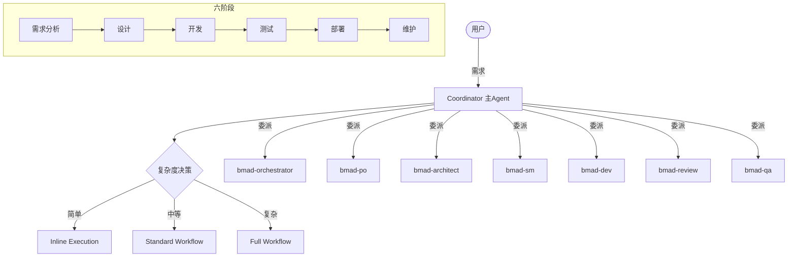

# Trae 生产级工程技能

[](https://opensource.org/licenses/MIT)
[]()
[]()
[]()

一套**适用于 TRAE AI coding Agent 的生产级工程技能**。这些技能规范了软件构建过程中高级工程师所使用的流程、质量控制标准以及最佳实践，并被整合到 Agent 中，以便其在开发的每个阶段都能一致地遵循这些规范。

具体落地为：将软件工程六阶段（需求、设计、开发、测试、部署、维护）封装为可执行流水线，由 Coordinator 编排 7 个专业 Subagent 协作完成，全程质量门控。

## 项目定位

本项目为 TRAE AI coding Agent 提供生产级工程技能，整合方式如下：

- **规范层**：高级工程师的流程、质量控制标准、最佳实践（整合到 Agent 与 Skill 中）
- **执行层**：7 个快捷命令（6 阶段 + 1 组合）驱动完整生命周期
- **能力层**：14 个方法论 Skill + 7 个 BMAD Subagent
- **约束层**：6 类规则（项目/安全/合规/质量/流程/YAGNI）

## 核心架构



## 智能体体系

主 Agent 承担 Coordinator 职责，编排 7 个 BMAD Subagent：

| Agent | 模型 | 职责 | 权限 |
|-------|------|------|------|
| **bmad-orchestrator** | GLM-5.2 | 仓库扫描、上下文准备 | 只读 |
| **bmad-po** | Doubao-Seed-2.1-Pro | 需求收集、PRD、质量评分 | — |
| **bmad-architect** | Doubao-Seed-2.1-Pro | 架构设计、技术选型 | 禁用 Edit |
| **bmad-sm** | GLM-5.2 | Sprint 规划、任务拆解 | — |
| **bmad-dev** | GLM-5.2 | 功能实现、TDD、Bug 修复 | — |
| **bmad-review** | Doubao-Seed-2.1-Pro | 代码审查、合规检查 | 禁用 Edit |
| **bmad-qa** | GLM-5.2 | 测试策略、执行、回归 | 启用 Playwright |

> 模型分层策略：深度推理角色（PO/Architect/Review）用最强模型，执行角色用标准模型，详见 [开发流程规范.md §2.2](file:///d:/yecll/Documents/LocalCode/testskills/.trae/开发流程规范.md)。

## 工作流

### 六阶段大循环

| 阶段 | 主导 Agent | 产出物 | 门控 |
|------|-----------|--------|------|
| 1. 需求分析 | bmad-po | `01-product-requirements.md` | PRD 质量 ≥90 + 用户审批 |
| 2. 设计 | bmad-architect + bmad-sm | `02-system-architecture.md` / `03-sprint-plan.md` | 架构质量 ≥90 + 用户审批 |
| 3. 开发 | bmad-dev + bmad-review | 源码 + 单测 + `04-dev-reviewed.md` | TDD 循环 + Review 通过 |
| 4. 测试 | bmad-qa | `05-test-report.md` | 测试套件通过 + 覆盖率达标 |
| 5. 部署 | Coordinator | 发布包 + CHANGELOG | CI/CD 通过 + 版本号一致 |
| 6. 维护 | bmad-dev | 修复 + 回归测试 | 根因定位 + 修复验证 |

### 三种执行策略

| 策略 | 适用 | 流程 |
|------|------|------|
| **Inline** | Bug 修复、单函数 | brainstorming(简) → TDD → verify |
| **Standard** | 新功能、多文件 | brainstorming → writing-plans → SDD → review |
| **Full** | 大型项目、多 Sprint | 完整六阶段 |

### 质量门控

四道门控贯穿全流程，未通过即回退：

1. **实现前** — 规格审批 + 计划审批 + 环境隔离（worktree）
2. **实现中** — TDD 循环完成 + self-review 完成
3. **验证前** — 测试套件通过 + 构建成功 + Lint/TypeCheck 通过
4. **合并前** — 验证证据新鲜（<5min）+ Review 通过 + 安全扫描通过

## 快捷命令

6 个阶段命令各自独立可执行（支持 refinement 复用），1 个组合命令编排完整流水线：

| 命令 | 阶段 | 用途 | 关键选项 |
|------|------|------|---------|
| `/bmad-requirements <描述>` | 1 需求 | PRD 生成与精炼 | `--feature` / `--skip-scan` |
| `/bmad-design` | 2 设计 | 架构 + Sprint 计划 | `--feature` / `--direct-dev` / `--target` |
| `/bmad-development` | 3 开发 | TDD 实现 + Code Review | `--feature` / `--skip-review` / `--max-iterations` |
| `/bmad-testing` | 4 测试 | QA 测试 + 回归 | `--feature` / `--skip-e2e` / `--skip-security` |
| `/bmad-deployment` | 5 部署 | 版本 + CI + Tag | `--feature` / `--version` / `--skip-ci` |
| `/bmad-maintenance <Bug>` | 6 维护 | systematic-debugging + TDD 修复 | `--feature` / `--direct-fix` / `--skip-regression` |
| `/bmad-pipeline <描述>` | 组合 | 编排阶段 1-5 完整流水线 | `--from` / `--to` / 透传各阶段选项 |

## 方法论 Skill（14 个）

| 阶段 | Skill | 用途 |
|------|-------|------|
| 需求/设计 | `brainstorming` | 需求与方案探索 |
| 设计 | `writing-plans` | 实施计划编写 |
| 开发 | `test-driven-development` | TDD 铁律（RED→GREEN→REFACTOR） |
| 开发 | `subagent-driven-development` | 逐任务派发 + Review |
| 开发 | `dispatching-parallel-agents` | 独立任务并行 |
| 开发 | `executing-plans` | 计划执行 |
| 开发 | `using-git-worktrees` | 工作区隔离 |
| 开发 | `finishing-a-development-branch` | 分支完成与合并 |
| 审查 | `requesting-code-review` | 审查请求 |
| 审查 | `receiving-code-review` | 审查反馈处理 |
| 测试 | `verification-before-completion` | 完成前强制验证 |
| 维护 | `systematic-debugging` | 根因定位四阶段 |
| 元 | `writing-skills` | Skill 编写规范 |
| 元 | `using-superpowers` | Skill 发现与使用 |

## 项目结构

```
.trae/
├── agents/          # 7 个 BMAD Subagent 定义
├── commands/        # 7 个快捷命令（6 阶段 + 1 组合）
├── rules/           # 6 类规则（项目/安全/合规/质量/流程/YAGNI）
├── skills/          # 14 个方法论 Skill
└── 开发流程规范.md   # 统一流程手册（37KB，六阶段+门控+异常处理+长任务模板）

docs/                # Skill 开发指南与模板
scripts/             # Skill 验证脚本
```

## 快速开始

### 1. 克隆项目

```bash
git clone https://github.com/yecllsl/trae-agent-skills.git
cd trae-agent-skills
```

### 2. 阅读核心规范

建议阅读顺序：
1. [AGENTS.md](file:///d:/yecll/Documents/LocalCode/testskills/AGENTS.md) — 项目总览与智能体体系
2. [.trae/开发流程规范.md](file:///d:/yecll/Documents/LocalCode/testskills/.trae/开发流程规范.md) — 六阶段工作流与质量门控
3. [.trae/rules/project-rules.md](file:///d:/yecll/Documents/LocalCode/testskills/.trae/rules/project-rules.md) — Coordinator 规则

### 3. 启动完整开发流水线

在 Trae CN IDE 中输入：

```
/bmad-pipeline 添加一个用户认证模块，支持 JWT 和 OAuth2
```

Coordinator 将自动编排六阶段流程：需求 → 设计 → 开发 → 测试 → 部署，阶段间设 STOP POINT 等待确认。

### 4. 单独执行某个阶段

每个阶段命令可独立运行，适合增量开发或精炼已有规格：

```
/bmad-requirements 添加数据导出功能，支持 CSV 和 JSON
/bmad-design --feature data-export
/bmad-development --feature data-export
```

### 5. 断点续跑

流水线中断后可从指定阶段恢复：

```
/bmad-pipeline 添加数据导出功能 --feature data-export --from testing
```

### 6. Bug 修复

```
/bmad-maintenance 登录接口在并发场景下偶发 500 错误
```

## 核心设计原则

| 原则 | 说明 |
|------|------|
| **规范整合到 Agent** | 流程、质量标准、最佳实践整合到 Agent 与 Skill，确保每阶段一致遵循 |
| **Rules 先行** | 任何操作前检查规则约束 |
| **Skills 指导** | 根据任务类型激活对应 Skill |
| **Subagents 执行** | 复杂任务委派专业代理，主 Agent 仅协调 |
| **Rules 验证** | 产出必须通过规则检查才可流转 |
| **长任务优先** | 每阶段封装为长任务，减少 LLM 交互中断 |
| **证据驱动** | 声称完成必须有验证证据，禁止"应该没问题"式声称 |
| **Orchestrator 中介** | Subagent 不直接与用户交互，所有问答通过 Coordinator 中转 |

## 贡献

欢迎提交 Issue 和 Pull Request！查看 [CONTRIBUTING.md](file:///d:/yecll/Documents/LocalCode/testskills/CONTRIBUTING.md)。

## 许可证

[MIT](LICENSE) (c) 2026

## 免责声明

本规范与方法论仅供个人学习和参考。使用时请确保遵守相关服务的使用条款。

## 相关链接

- [Trae IDE 官网](https://www.trae.ai/)
- [Skill 开发指南](file:///d:/yecll/Documents/LocalCode/testskills/docs/SKILL_DEVELOPMENT_GUIDE.md)
- [贡献指南](file:///d:/yecll/Documents/LocalCode/testskills/CONTRIBUTING.md)
- [代码 Wiki](file:///d:/yecll/Documents/LocalCode/testskills/CODE_WIKI.md)
